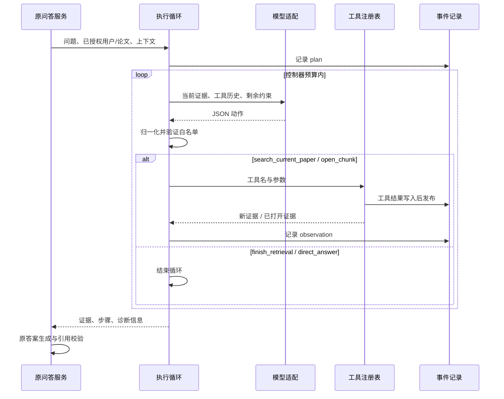

# QA Agent 第一阶段：可阅读、可测试的执行内核

状态：代码已实现；不代表独立 QA 服务已部署。版本与发布按 [交付规范](versioning-and-delivery.md) 执行。

本阶段沿用现有手写执行器，学习重点是一次 Agent 运行如何调用模型、执行工具、累积证据与停止。
保持现有 JSON 控制协议、提示词、预算、引用编号策略和 HTTP/SSE 契约，不引入新的 Agent 框架。
Agent 检索结束后，答案生成、引用校验、消息落库仍由原 `server/qa/service.mjs` 负责。

## 建议阅读顺序

| 顺序 | 文件 | 负责什么 | 主要边界 |
| --- | --- | --- | --- |
| 1 | `server/qa/agentRunner.mjs` | 组装已有模型、检索、数据库实现 | 原有导出保留，调用方无需迁移 |
| 2 | `server/qa/agent/loop.mjs` | 模型决策 → 工具 → 观察 → 下一轮 | 管理运行状态、预算、结束与错误 |
| 3 | `server/qa/agent/controller.mjs` | 构建模型消息、解析和归一化动作 | 接收注入的 `complete`，不直接访问供应商 |
| 4 | `server/qa/agent/tools.mjs` | 注册、分发当前论文工具 | 从可信上下文绑定用户和论文 |
| 5 | `server/qa/agent/events.mjs` | 写入步骤/工具记录、更新时间线、发布事件 | 持久化成功后输出原 SSE 事件结构 |

辅助模块：`policy.mjs` 放预算与已有策略，`context.mjs` 处理多轮上下文，
`evidence.mjs` 合并/去重/选择证据，`queryPlan.mjs` 提供纯查询规划。
`heuristicLoop.mjs` 保留原规则驱动执行路径。`errors.mjs` 保留原错误类型与已完成步骤。
这些执行模块不导入 Supabase、HTTP 服务或供应商客户端；生产依赖集中在组装入口。



模型当前收到的是预算上限、历史和轮次；是否达到调用上限由循环代码判断，不依赖模型自觉遵守。

## 四个接口如何协作

**模型适配**：`createQaControllerAdapter({ complete })` 返回 `callController(input)`。
`complete({ messages, model, signal, temperature })` 返回 `{ content }`。
现有 `server/chatModels/client.mjs` 继续处理 provider 调用与请求参数；共享的翻译适配逻辑没有改动。
模型返回 JSON 动作，循环再次归一化并验证动作白名单。
这一版尚未切换到供应商原生 function calling，也没有引入通用工具 JSON Schema 校验框架。

**工具注册**：每次运行通过 `createCurrentPaperToolRegistry(...)` 绑定身份、论文、取消信号和检索实现。
`execute(name, input, context)` 只能分发已注册的 `search_current_paper` / `open_chunk`。
模型参数中的 `userId`、`userDocumentId` 或 `scope` 不会覆盖授权范围。
`open_chunk` 只打开这次运行已持有的证据，不按模型给出的任意数据库 ID 读取其他文档。
工具的 `effect: read` 指业务内容只读，执行过程仍会写入审计步骤。

**事件输出**：`createAgentEvents({ insertStep, insertToolCall, emit })` 统一管理持久化与发布。
`recordStep(state, eventName, input)` 写步骤，`recordToolCall(state, step, input)` 将工具结果关联到步骤。
前端继续接收 `agent_step`、`gap_check`、`tool_call`、`observation` 等已有事件。
发送的是行动摘要、输入和结果概要；不新增模型私有推理文本的展示或存储。

**执行循环**：分别维护证据、已打开证据、工具历史与调用次数。
工具返回后，证据会合并、重新编号，再进入下一次模型调用；模型不能直接执行任意函数。
正常结束与抛出 `QaAgentRunnerError` 时，服务都能拿到当前步骤时间线。

## 不需要 API key 的学习示例

```bash
npm run demo:qa
npm run demo:qa -- direct-answer
npm run demo:qa -- carryover
npm run demo:qa -- budget
npm run demo:qa -- unknown-action
npm run demo:qa -- search-error
npm run demo:qa -- heuristic-empty
```

脚本只调用纯执行模块与内存模拟依赖，输出每条事件、工具输入、控制器调用次数与最终证据。
在 `loop.mjs` 的 `callController`、`tools.execute` 和 `events.recordStep` 设置断点，
可以逐步看到决策与执行的区别。固定时间只用于模拟轨迹，不影响线上代码。

建议先观察默认场景：搜索得到 `C1` → 打开 `C1` → 下一轮能看到完整文本 → 结束检索。
再观察 `budget`：模型继续要求检索，但执行器按上限停止。

## 验证与后续边界

拆分前以 `23ddc3b` 的原执行器生成了 7 组完整合成轨迹；拆分后逐项比较结果、持久化入参、
事件顺序、模型上下文和检索参数，全部一致。覆盖正常检索/打开/结束、直接回答、带入上轮证据、
预算耗尽、非法动作、检索失败、规则检索为空。均不调用真实模型或数据库。

持续回归在 `tests/qa/agentRunner.test.mjs` 和 `tests/qa/agentRuntime.test.mjs`；
`tests/runtime/` 验证 QA 关闭时其他接口的可用性、独立服务路由，以及发布失败后的 QA 回滚。
CI 还运行文库、翻译、MathPix、模型等全项目测试。

后续阶段再引入可恢复运行状态、取消/超时的统一终止语义、工具参数 schema、真实问答评测。
当前保留的 `maxSteps` 是记录上限；实际执行次数由 controller/search/open 的预算限制，
还不是统一的硬终止状态机。现有步骤落库也不等于断点恢复或进程崩溃后恰好执行一次。

新增工具时需要一起修改工具声明/处理器、模型动作协议、循环预算与观察处理、失败契约测试。
在这套边界稳定后，再判断是否需要动态调度或框架，避免仅为增加工具名称而提前泛化。
