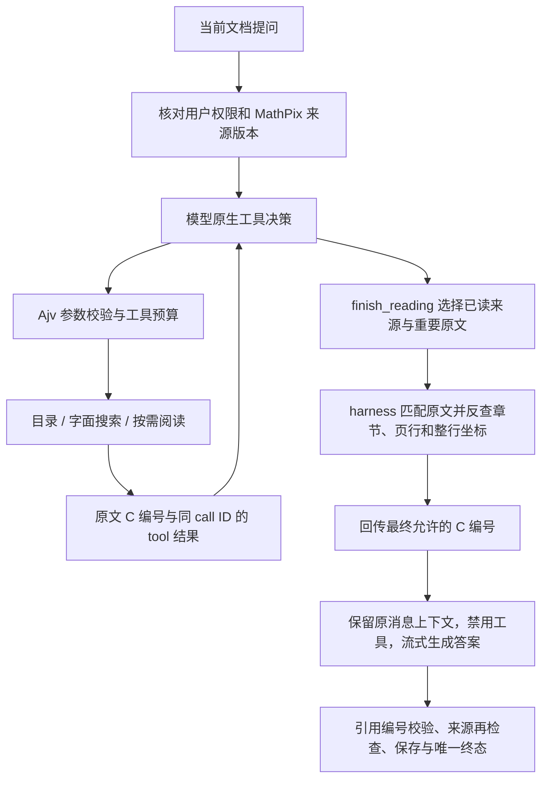

# P2 实施记录：模型自主阅读与软件原文定位

日期：2026-09-24。QA 版本：`0.2.0-alpha.4`；应用版本：`0.1.0`。

代码已实现，全项目检查和供应商真实合成调用已通过。**独立测试库迁移与本地 QA 部署已完成，生产未部署；用户已确认 P2 总体验收通过。** 用户已确认默认使用 DeepSeek V4.1 Flash。部署身份、真实数据库与浏览器检查见 [本地部署记录](qa-agent-stage-2-local-deployment.md)。本文区分合成工程验证与人工质量结论。用户另反馈的公式格式和引用等待问题已修复并本地部署，修复后的人工复验待进行；详见 [验收反馈处理](qa-agent-polish-2026-09-24.md)。

## 运行过程与学习入口

| 文件 | 负责什么 |
| --- | --- |
| `server/qa/documents/stream.mjs` | 组织 HTTP/SSE、会话历史、取消、超时、答案与引用保存 |
| `server/qa/documents/runtime.mjs` | 手写循环、完整 assistant/tool 消息续接、修正机会、预算及终止 |
| `server/chatModels/qaToolAdapter.mjs` | 原生工具协议、供应商思考续接字段、usage、完整结束校验 |
| `server/qa/documents/tools.mjs` | 工具清单、Ajv、授权闭包、游标、运行内结果复用 |
| `server/qa/documents/source.mjs` | 从当前用户文档读取 MathPix 页缓存，复核权限与解析版本 |
| `server/qa/documents/view.mjs` | 保留物理页与原始行的文档视图、NFC/空白归一化反向映射、证据身份 |
| `server/qa/documents/citations.mjs` | quote/source 选择、重复句消歧、子范围 C 编号、位置与最终编号校验 |
| `server/qa/documents/runContext.mjs` | 全局步骤序号、每次真实模型调用、单一终态和用量覆盖率 |
| `src/qa/sourceIdentity.ts` | 新旧引用身份匹配，防止空 chunkId 互相误配 |

运行 `npm run demo:qa-document` 可离线观察完整的两轮示例，不调用模型、不连接数据库。`C1` 表示读到的全文；模型选一句原文后，软件生成新的子范围 `C2`，父范围含义保持不变。最终答案只允许引用 `C2`。

## 这次实现的边界

- 新路径只读当前文档的文本。输入是 MathPix 页/行缓存，不读取预切 chunk、向量索引或 rerank；MathPix 解析仍是前置条件。
- 阅读与搜索补充同一已读完整行的 `latexLines`，并计入资料预算；原 `text`、引用身份和行坐标不变。未读的行余文不通过 LaTeX 暴露，表达未完整返回时标记 `latexOmitted`。提示词 `qa-document-tools-v2` 约定行内及独立公式格式。
- 模型可以直接读短文全文，也可浏览目录、查词、读章节/页段。`finish_reading` 的选择参数只含来源编号、原文及可选紧邻上下文，没有页码、行号、offset 或坐标。
- 目录由软件解析标题或保守推断；缺可靠标题时按页阅读。搜索是字面规则，语义改词交给模型；没有命中不是“全文不存在”。
- quote 只在实际读到的来源覆盖内匹配。重复句不猜位置，返回可修正的歧义错误；跨页先定位起始页，界面允许跳转后续页。
- 原文范围与整行高亮分别记录。缺坐标时展示部分行/仅页码定位，逐字高亮不在本轮范围内。
- 新引用保存 `source_kind/source_version/evidence_key/source_record_id/source_locator`。MathPix 没有单独 id，来源记录键为 `content_sha256:mathpix_options_hash`，始终限定用户和文档。
- 每次工具执行、缓存命中、生成前和保存前都重新检查来源。历史引用点击在相同 PDF 指纹下先滚动浏览，远程核对最新版本后才画高亮；重解析后提示失效，不把旧矩形叠到新版本，不进行模糊文本匹配。
- 最终 verifier 验证来源和编号合法性，**不证明答案每个论断均被引文蕴含**。真实论文语义支持程度由后续人工验收确认。

默认预算为 8 次规划、12 次工具调用、每批 4 个工具、2 轮错误修正。普通阅读每批约 16k 字符，全文上限 64k，累计资料约 96k；单模型 120 秒，总请求 300 秒，独立 QA 服务最多 2 个流式请求、同一用户 1 个。全文超限返回明确错误，不用头尾拼接冒充全文。达到探索预算时依据实际已读来源生成范围受限回答。

`QA_AGENT_RUNTIME=legacy-json-v1` 显式保留原执行器。新路径失败不会调用旧检索。旧全文分支只有授权后的缓存读取类错误可回落；模型开始生成、取消、关键记录失败或保存失败均终止。旧路径也使用全局步骤记录，跨轮带入保留 `lineRegions`。

## 验证记录

`npm run ci`：339 项测试、版本校验、TypeScript 与前端构建通过；最终结果以提交对应 CI 为准。覆盖工具参数、消息配对、私有思考字段续接、歧义/越界、游标、缓存权限、跨页、旧数据兼容与多用户 RLS。迁移在 PGlite 上重复应用并验证 CHECK 的 NULL 绕过、外键、删除来源和版本变化。

故障测试覆盖自然语言提前回答、重复 call ID、混合 finish 批次、重复无进展工具、取消、超时、流式 EOF、数据库保存失败、旧全文供应商错误等；失败保留部分正文，不自动再次生成。数据库完全不可用时终态只能尽力写入，不能承诺跨多张表的原子事务。

Playwright 首轮使用真实 QA/PDF 组件与浏览器内合成 API 记录验证：无 QA 索引仍可提问、刷新恢复历史引用、关键句所在行高亮、跨页起点与后续页选择、未选父编号不可点击。PDF 为两页合成资料。迁移后又通过独立测试库真实认证、实际模型、引用落库与浏览器恢复/定位检查；两轮验证范围分别见 [本地部署记录](qa-agent-stage-2-local-deployment.md)。截图保留于本机 `output/playwright/qa-p2/`。

固定合成集位于 `tests/fixtures/documentAgentCases.mjs`，包含 6 篇中英文文档和 24 个问题。供应商调用使用实际凭据，但没有发送用户文档；`scripts/evaluate-document-agent.mjs` 可重跑。结果与聚合用量见 [JSON 统计](qa-agent-stage-2-evaluation.json)。

| 模型 / 模式 | 问题数 / 协议通过 | 模型调用数 | 平均总耗时 | 实测输入缓存命中率 |
| --- | --- | --- | --- | --- |
| DeepSeek Flash / quick | 24 / 24 | 98 | 3.88 秒 | 72.81% |
| DeepSeek Flash / standard | 2 / 2 | 7 | 5.64 秒 | 58.54% |
| DeepSeek V4 Pro / standard | 2 / 2 | 8 | 9.21 秒 | 64.57% |
| Qwen Flash / standard | 2 / 2 | 8 | 13.98 秒 | 47.62% |
| Qwen Max / quick | 2 / 2 | 8 | 4.88 秒 | 42.54% |

全部调用的输入/输出 token 均有观测，比例按命中输入 token 总量除以对应输入总量计算。首次调用也可能已命中供应商缓存；这不是受控冷启动实验，不保证真实长论文的命中率和延迟。32 次问题中的模型调用共 129 次，新增规划开销必须计入；没有据此声称比旧 RAG 更便宜。货币费用与显式缓存创建账单未独立核对，保留 unknown。

模型能力按 `QA_DOCUMENT_MODELS` 开放，默认先开放 DeepSeek Flash/V4 Pro。按用户确认，界面初始选择和服务端未指定模型时的默认值均为 `deepseek-flash`（DeepSeek V4.1 Flash）；目录版本为 `2026-09-24.1`。Qwen 需显式加入并配置官方区域接口。GLM/Kimi 原生工具路径未开放。上述小样本不代表所有推理档均完成人工质量验收。

设置页以逐次 `model-call` 记录计入用量，已有 `answer-stream` 的最终调用 usage 继续用于历史读取，但不重复累计。旧记录没有逐次调用数据时保留原统计。通用步骤日志不保存整篇原文或模型私有推理；授权会话的引用快照保存必要原文以便恢复。

## 本地部署顺序与回退

1. 保留当前 `output/qa-local-server/deployment.json`、旧制品和 `.env.qa.local` 的私有备份，并备份测试库。
2. 将 `supabase/migrations/20260924_qa_document_tools.sql` 应用到**独立 QA 测试库**。可以在测试项目 SQL Editor 执行，或在 `.env.qa.local` 提供服务器专用 `QA_TEST_DATABASE_URL`。不要在聊天或公共仓库粘贴密码。
3. 执行 `node --env-file=.env.qa.local scripts/check-qa-document-schema.mjs`；该命令检查字段可读性，完整约束与 RLS 仍须来自整份迁移。
4. 从通过 CI 的提交运行 `npm run package:qa`，校验 SHA 和校验和，在独立 release 安装依赖。
5. 兼容前端使用 QA 模式及测试项目；设置 `QA_AGENT_RUNTIME=document-tools-v1`，只替换 8789 的 QA 进程，核对 `/api/qa/health` 的版本、SHA 和 runtime。主 API 8787、主前端 5173、测试辅助 API 8790 保持原进程。
6. 本机测试入口为 `https://127.0.0.1:5174`。需完成登录、无索引文档问答、保存/刷新引用和点击定位，再交付人工测试。健康检查不等于这些流程通过。

2026-09-24 已通过服务器专用连接完成测试库 `public` schema 与数据的一致性备份，再以事务应用迁移。5 个新引用字段、约束、RLS 和新日志类型均已核验；14 条旧 chunk 引用保持完整。本地已显式开启 `document-tools-v1`，原生路径提示“文档已就绪，可提问”。测试入口仍为 5174，独立 QA API 为 8789。

回退时恢复备份环境文件与旧 QA release，核对旧 SHA。增量字段和新历史保留；不降级/删除数据库字段，也不重建索引。生产发布和切流不在本次授权范围内。

## 接下来人工测试

选一篇 MathPix 已完成、没有 QA 索引的论文，询问“XXX 在文中怎样实现”。确认模型自行读取资料，回答引文落到对应章节/关键句所在行。再检查跨页引用、刷新后引用、中文提问英文论文、取消后历史状态、文档中不存在答案的情况。

工程验证不替代旧混合检索/全文基线的同题质量、成本对照；长论文、公式表格文本、多轮追问及真实 OCR 质量仍需扩展评测。跨文档、图像理解、逐字高亮仍未实现。
