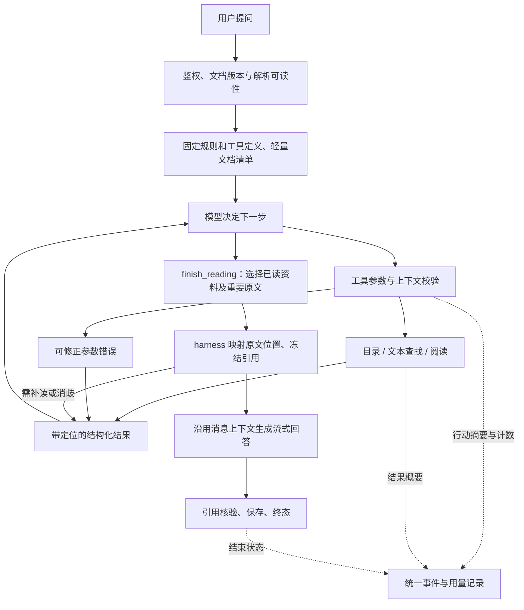

# QA Agent 第二阶段：工具协议与模型自主查阅文档

日期：2026-09-24。状态：**实现已完成，独立测试库迁移与本地切换待执行，人工验收待进行**。

本文保留批准的设计与验收标准；实际文件、测试、供应商实测和交付限制见 [P2 实施记录](qa-agent-stage-2-implementation.md)。

本文是原定第二步“接入工具调用协议、参数校验、工具结果回传”的实施依据，
并纳入最新方向：尽量减少 embedding、预设检索流水线和 rerank 的依赖，由模型通过工具规划查阅当前文档。
本轮只交付方案；所有新工具、字段、开关、文件名、预算和迁移均为拟议设计。
第一阶段的关闭范围与确切基线见 [收尾记录](qa-agent-stage-1-closeout.md)。
章节定位与关键句所在行高亮的补充契约见 [引用范围与定位契约](qa-agent-citation-contract.md)；逐字高亮暂不实现。

## 1. 推荐方案与交付目标

继续使用手写执行循环。新路径默认采用 **模型原生工具调用 + 文档目录、文本查找、按需阅读**。
模型决定查哪里、搜什么词、是否扩读、证据是否足够；程序负责授权、参数校验、来源定位、预算和终止。
引用采用 harness 职责划分：模型只选择已读资料与重要原文；软件维护文字到章节、页行和坐标的映射，模型不推算章节位置或输出定位参数。

默认新路径应满足：

- 已完成 MathPix 解析的当前文档，无需向量索引就能开始问答。
- embedding API、向量 RPC 和 rerank API 调用次数均为 **0**。
- 模型可直接读适合上下文预算的全文，也可按章节、页码和字面关键词逐步查阅。
- 证据可回到文档版本、页码、文本范围及已有坐标；查询未命中不能被表述为文档一定没有答案。
- “XXX 在文中怎么实现”的回答可引用对应章节或关键句所在原文行；引用范围独立于阅读范围，逐字高亮不在本期范围内。
- 每次调用有对应结果，模型可修正参数错误；缓存命中和全链路成本可测。

“减少检索依赖”在这里指取消强制的 embedding → 向量召回 → rerank 流水线。
文本查找和页码定位仍然存在，它们作为便宜、可解释的工具受模型调度。
模型的原生能力指工具调用、理解和规划；文档内容仍须由工具提供，不能用模型的既有知识代替来源。

| 方案 | 本项目的适用性 | 本阶段决定 |
| --- | --- | --- |
| 每次直接塞入全文 | 短论文的整体理解方便，但可能增加成本，超长文档与精确定位仍需处理 | 保留为模型可选择的阅读方式，不固定每问必走 |
| 模型自主调用目录/搜索/阅读工具 | 适合当前单篇论文范围，减少预处理与外部服务依赖，便于学习 Agent 闭环 | **默认推荐路径** |
| embedding + 混合检索 + rerank | 现有功能已经可用，适合做质量和成本对照 | 保留旧执行器供显式切换、回滚与评测，不默认作为新路径的隐藏回落 |
| 把 PDF 交给供应商托管文件搜索 | 会引入另一套文件上传、定位、删除和费用契约 | 不作为 P2 的前置依赖 |

这个方向参考 Anthropic 对按需获取上下文的工程实践：保留轻量定位信息，让模型用搜索与阅读工具逐步获取资料。
这是设计参考，不是本项目准确率或速度的验证；自主探索也可能增加模型轮次。
见 [上下文工程](https://www.anthropic.com/engineering/effective-context-engineering-for-ai-agents) 与
[工具设计实践](https://www.anthropic.com/engineering/writing-tools-for-agents)。

## 2. 现有代码中的真正前置依赖

核查基线：`2bc8bb5`，运行基线：`1cc80bd / 0.1.1-alpha.1`。

| 位置 | 现状 | P2 必须处理 |
| --- | --- | --- |
| `server/qa/agent/controller.mjs` | 模型输出普通 JSON action；每轮重建 system + user | 原生 tool calls、完整消息续接、逐次 usage |
| `server/chatModels/client.mjs` | 读取 content；答案检查只接受正常 stop 和非空文本 | 新增 QA 工具适配器，接受工具轮的空 content 与 tool_calls 结束原因；答案检查独立保留 |
| `server/qa/agent/tools.mjs` | 工具只有名称/说明，无参数 Schema | 单一工具定义、结构校验、上下文校验、结果协议 |
| `server/qa/retriever.mjs` | 搜索必须有 ready 索引并调用 embedding；全文加载也先 requireUsableIndexJob | 新文档来源层直接校验用户文档及解析产物，不经过该索引前置条件 |
| `server/qa/indexJobRunner.mjs` | 缺 embedding 配置时建索引失败 | 新路径不启动该 worker；旧索引功能保持可用 |
| `src/qa/PaperQaPanel.tsx` | 只有 ready 且 chunkerVersion 匹配才能提问 | 文档阅读 readiness 独立于 semantic index readiness |
| `server/qa/documentParser.mjs` | 返回 bodyPages，遇到 References 后停止；过滤无文本页 | 新的阅读视图保留参考文献、后续附录和真实页号，并标注无文本页；不改变旧索引的 body 视图 |
| `server/qa/agent/evidence.mjs` | 证据按分数重排并重新分配 C 编号 | 运行内来源身份稳定；排序不改旧消息和引用身份 |
| `supabase/schema.sql` | 引用的 chunk_id 是必填外键；两张步骤/工具表限制工具名 | 兼容增量迁移，不能伪造 chunk UUID 或只改前端类型 |
| `src/types/domain.ts`、`PaperQaPanel.tsx` | 引用/证据按 chunkId 关联 | 支持阅读来源的 identity，防止多个空 chunkId 被错误关联 |

因此，仅关掉 Voyage 或 rerank 配置不会得到新设计：当前索引、读取和界面条件会阻断请求。

## 3. 从第一阶段承接的架构

保留 P1 的四个边界，用新实现替换具体协议和工具，不重新引入 Agent 框架。



新路径不强制先调用 queryRouter 再走不同执行器，问题类型判断交给同一个模型规划循环。
旧路径保留原路由器和已验收全文实现，便于受控对照；新路径读取全文使用下面的阅读工具。
不会把旧 `global → 全文失败 → 混合检索` 的回落隐式带入新路径。

拟议模块：

| 模块 | 责任与复用 |
| --- | --- |
| `server/qa/documents/source.mjs` | 授权、读取已存在解析产物、冻结文档/解析版本 |
| `server/qa/documents/view.mjs` | 页/行/章节视图、确定性字面搜索、可定位的阅读结果 |
| `server/qa/agent/toolProtocol.mjs` | 内部 ToolCall/ToolResult、校验和模型消息续接 |
| `server/qa/agent/toolDefinitions.mjs` | 工具 Schema、说明、版本与处理器注册 |
| `server/chatModels/qaToolAdapter.mjs` | QA 专用供应商工具协议、完整 assistant 消息、usage |
| `server/qa/agent/loop.mjs` 或独立新循环 | 原生调度、去重、预算、finish；旧实现留作明确版本路径 |
| `server/qa/runContext.mjs`、现有 events 层 | F02 的唯一序号、用量、终态、失败记录 |

这些是后续拟建位置，本轮不创建模块或修改共享翻译客户端。

## 4. 文档来源与可读性

### 4.1 不经过向量索引的读取

1. 由可信会话取得 userId，使用 `requireUserDocument()` 校验未删除的当前文档。
2. 从数据库文档记录取得内容哈希，查找同一用户、文档、内容哈希且已完成的 MathPix 产物。
3. 冻结 `documentVersion`：包含文档内容哈希、解析产物修订标识/内容摘要和阅读解析器版本。
   同一 PDF 重新 OCR 可能改变文本与坐标，因此单独的 PDF 哈希不足以标识阅读版本。
4. 构造服务端文档视图。MMD 用于保留公式；页/行数据用于定位，不能凭拼接全文偏移猜坐标。
5. 工具调用前检查权限、取消信号和当前文档版本。发生删除或版本改变时结束本次运行，不能混用两个版本。

MathPix 尚未完成时，显示“文档解析未完成”，由已有明确用户操作触发解析。
P2 不自动启动付费 OCR，不自动建立语义索引。PDF.js 文本回退和页面视觉工具作为后续独立能力。

### 4.2 完整的阅读视图

- 复用存储读取与文本/坐标归一化逻辑，新增保留全部页的视图；旧索引默认仍使用 bodyPages。
- 目录优先来自已存在结构；规则提取的标题标记为 inferred，无可靠标题时提供页段导航，不生成伪目录。
- 保留参考文献及其后的附录；页号以 PDF 实际物理页从 1 开始，印刷页码另作显示信息。
- 缺失文本、空页、公式表示缺失和无法可靠对齐的 MMD 都在结果中明示，不补造页码或高亮区域。
- 建立便于字面匹配的规范化文本副本，保留到原始页/行的映射；回答引用取原文，而非规范化搜索串。
- 原始页内行号在冻结视图中稳定，行坐标保留 lineNumber；harness 记录每份实际返回文字的 readCoverage 与原文字符映射，模型无需输出行号。

### 4.3 前后端 readiness

拟新增受鉴权的 `GET /api/qa/document-readiness?activeDocumentId=...`，返回
`readable / parsing / missing / error`、文档版本，以及独立的 `semanticIndexReady` 能力。
不把无 embedding 的文档伪装成旧索引 ready，也不改变旧状态枚举的含义。
Ask 面板及相关 ReaderShell 入口在新执行器下按 readable 放行；旧执行器仍要求旧索引条件。
实现时需遍历所有提问/重试/重新生成入口，不能只修改一个按钮。

## 5. 首版工具：三个资料工具与一个终止动作

全部工具只读业务资料，身份和文档范围由服务端闭包绑定；模型不能传用户 ID、存储路径或任意 SQL。

| 工具 | 输入要点 | 输出 | 选择场景 |
| --- | --- | --- | --- |
| `get_document_outline` | 可选 cursor | 标题、真实页数、章节定位、可全文读取大小、后续游标；长目录分页 | 先认识结构，定位章节 |
| `search_document_text` | queries、matchMode、可选页范围、limit、cursor | 命中原文预览、页/行定位、匹配词、已扫描范围、hasMore | 找术语、缩写、数字、公式标签、图表标题 |
| `read_document` | mode=pages/section/full，模式对应定位参数、可选 cursor | 有界原文、稳定证据标识、页/行/坐标、覆盖范围、截断及续读信息 | 读原文、扩大上下文或读取可容纳的全文 |
| `finish_reading` | mode=grounded/direct/insufficient、citationSelections、简短 answerOutline | 校验后的引用范围、allowedCitationIds 与答案准备结果 | 证据足够、无需论文的交流，或确认当前证据不足 |

`finish_reading` 是执行器控制动作，虽以工具协议表达，不读取文档，不生成答案。
同一批调用中只能单独出现，避免边执行工具边结束。模型自由选择工具顺序，没有预设的“必须先搜后读”。
`citationSelections` 取代早期草案的 evidenceIds 输入，只接受已读来源编号及重要原文摘录，或选择整体已读资料；章节位置、页行范围和坐标由 harness 映射。
结构、模式限制、校验及返回映射以 [引用契约](qa-agent-citation-contract.md) 为准，不增加独立的引用定位模型调用。

### 5.1 文本搜索规则

首版支持 literal、all_terms、any_terms；英文做 Unicode/空白/大小写归一化，中文支持字面子串，公式支持文本及可用 LaTeX 串匹配。
不执行任意正则或 shell，不自动调用向量服务；结果按命中规则、页号和位置确定性排序，不调用模型 rerank。
一次可提交最多 4 个相关查询，每个最多 200 字符；语义扩展、英文术语和缩写由主模型决定。
没有结果是正常观察：模型可换词、浏览目录、扩大页范围或继续顺序阅读。
返回扫描范围与游标；分页只扫描部分内容时，不能宣称已经搜索全文。

### 5.2 阅读与全文预算

- pages 模式明确页区间；section 模式只接受本版本目录产生的 sectionId。
- 首次定位与续读参数不得矛盾，游标绑定授权文档版本、工具参数与位置，不能由模型伪造范围。
- 页段/章节过长时返回实际覆盖范围与 continuation，不把截断数据说成完整章节。
- full 模式只有在文档内容与消息历史、工具定义、输出预留一起满足预算时执行。
  不满足时返回 `FULL_TEXT_TOO_LARGE` 和可行的页段信息，让模型选择分段读取；不静默执行“头尾拼接”冒充全文。
- 搜索预览也有准确来源映射。只有实际返回的文字进入 readCoverage，完整关键句可引用；句子被截断或需要更大上下文时必须继续阅读。整行高亮不扩大引用的原文支持范围。
- full 的可引用资料按页/范围输出；无法对齐的独立 MMD 片段只能作为明确标注的补充资料，不能据此虚构页级证据。

例如解释实验差异：模型可以先看目录，读实验章节，再查一个表格编号，最后读相邻讨论。
概述一篇短论文时可以直接请求 full。中文问题查英文论文时，由模型提出英文术语；无需另建查询改写模型。

## 6. 原定第二步的三个协议交付

### 6.1 原生工具调用

工具定义是唯一来源：名称、description、inputSchema、版本、业务只读属性和 handler 一起注册。
适配器根据供应商声明 tools，把工具响应归一为内部对象；执行循环不解析供应商特有字段。

```ts
type ToolCall = { id: string; name: string; arguments: unknown };
type ToolResult =
  | { callId: string; ok: true; data: unknown }
  | {
      callId: string;
      ok: false;
      error: { code: string; message: string; retryable: boolean };
    };
```

原生 assistant 消息和内部对象分别保存：前者用于 API 续接，后者用于调度与脱敏记录。
不能只保留 content 而丢掉 call ID、tool_calls 或供应商要求的 reasoning 字段。
DeepSeek 官方说明工具参数可能不合法，要求应用自行校验；思考工具对话还要求保留必要 reasoning_content 回传。
见 [工具响应契约](https://api-docs.deepseek.com/api/create-chat-completion/) 和
[思考模式工具对话](https://api-docs.deepseek.com/guides/thinking_mode/)。

首版决策轮使用非流式请求，先把协议闭环做完整；不会把工具轮的普通 content 直接当作最终回答发送。
模型发出合法 finish_reading 后，追加其工具结果，使用同一消息上下文和稳定工具清单、禁止新工具调用，生成最终流式答案。
这样保留现有 SSE 回答体验，同时省去新路径的独立 queryRouter；仍须统计每次决策与最终答案调用的成本。
决策轮若仅返回自然语言而未给控制动作，允许一次有界协议纠正；再次不合规则结束并记录原因，不无限追问。

| 供应商 | 接入计划 | 本轮证据边界 |
| --- | --- | --- |
| DeepSeek | 首个闭环候选；模型 ID 沿用目录，支持现有选择，不擅自换默认 | 原生工具真实调用已通过；模型/推理模式样本数见实施记录 |
| Qwen | 第二个独立适配验证，覆盖关闭/开启思考及缓存参数 | [官方 Function Calling](https://help.aliyun.com/zh/model-studio/qwen-function-calling) 已核对；不能由普通聊天通过推定工具通过 |
| GLM / Kimi | 各自官方直连接口逐项验证后开放新执行器 | 现有普通 QA 兼容不等于原生工具兼容；不套用百炼代理这些模型的参数 |

能力按 provider、模型 ID、接口和思考模式登记。尚未通过的组合可继续显式使用旧执行器，
或返回清晰的不支持状态；不在执行一半后偷偷切模型、切协议或调用语义检索。
供应商需要的原始续接字段只放在本请求内存中，不加入普通事件或长期审计日志；
同一用户的下一次提问，默认从已向该用户展示的答案及其授权来源快照建立新运行，
不承诺跨问答保留完整原生消息历史。对话和来源始终按用户隔离。

### 6.2 参数校验与错误修正

JSON Schema 作为唯一结构契约，拟用 Ajv 编译校验，在正式实现时锁定依赖版本。
采用严格 Schema 检查，不做隐式类型转换、删除多余字段或偷偷补业务参数；对应选项见
[Ajv 官方说明](https://ajv.js.org/options.html)。供应商 strict 模式只作附加能力，不能替代本地校验。

固定 Schema 定义类型、必填项、长度、数量、枚举和 additionalProperties=false。
工具执行前再做上下文校验：页范围、sectionId、cursor、证据身份、授权版本和剩余预算。
这些动态值不填进每轮重写的 Schema enum，以免扰动缓存前缀。

可修正错误返回 `INVALID_TOOL_ARGUMENTS / UNKNOWN_SECTION / INVALID_CURSOR / FULL_TEXT_TOO_LARGE`，
只包含字段路径、原因和可行范围，不含堆栈或凭据。本运行最多两轮参数修正，修正也消耗模型预算。
引用选择的 QUOTE_NOT_FOUND、AMBIGUOUS_QUOTE 等错误见 [引用契约](qa-agent-citation-contract.md)，共用修正预算；模型可补读或提供原文上下文，不能通过猜测页码修复。
权限失败、文档版本变化、用户取消、关键记录失败是终止事件，不交给模型尝试绕过。

### 6.3 工具结果回传与重复调用

保留模型生成的完整 assistant 调用消息，每个 call ID 对应一个成功或失败的 tool 结果，再请求下一轮。
多调用响应先检查总数和协议完整性，按返回顺序串行执行；不假设每次只返回一个调用。
有可修正错误时仍为所有待回传调用补齐对应结果；取消或终止时不再发起后续模型请求。
重复/缺失 call ID 是协议错误，不能按工具名称猜配对关系。

工具结果包含来源版本、覆盖范围、证据标识、原文与 continuation。
向模型回传数据与向前端/数据库发布摘要是两个出口；新增 observation 并不代表模型已经收到结果。
相同参数重复调用可命中本运行的工具缓存，但仍保留本次 call ID、审计记录并计入调用预算。

## 7. 稳定证据、引用与数据库迁移

### 7.1 来源身份与显示编号分开

阅读资料和引用子范围分别以授权文档、documentVersion、viewVersion 及规范化 sourceSpans 形成稳定 evidenceKey。
sourceSpans 是 harness 维护的原文页/行/字符区间；同一行中的不同摘录不因高亮同一矩形而混为同一身份。
同一来源在当前运行首次进入证据集合时分配 C1、C2 等显示编号；后续重排不得重新编号。
跨用户问答重新建立显示编号映射，但 evidenceKey 保持可追溯；历史消息按自己的快照解释 C 编号。
搜索结果和完整阅读的来源范围可能不同，必须分别标识，不因文字相似强行合并。

引用至少保留：授权文档、来源版本、evidenceKey、显示编号、页/行范围、原文片段及可用 lineRegions。
坐标继续按页面实际宽高归一化；坐标缺失时允许页码定位，不能制造矩形或宣称已有精准高亮。
新路径不为引用伪造 `user_paper_chunks.id`，也不要求为了保存引用先执行 embedding。

当前 citationVerifier 只核对 C 编号是否属于本次证据，不能证明每个论断都被证据支持。
P2 增加版本/定位一致性检查；语义支持程度仍纳入人工评测，不另加一个强制模型 verifier 或 reranker。

### 7.2 章节与关键句所在行

[补充契约](qa-agent-citation-contract.md) 规定：模型声明读过的来源及重要原文，harness 负责位置映射。阅读覆盖、引用原文范围与整行高亮范围分别记录。
finish_reading 的 quote 选择仅在所列已读文字中唯一匹配，重复原文须用已读上下文消歧；source 选择由软件判断是否完整对应真实章节，部分覆盖不得冒充整章。
模型不填写章节边界、页行或坐标；harness 产生稳定的子范围身份，新范围分配新 C 编号，不改变父证据编号的含义。
最终答案只允许使用本次选择通过后的 allowedCitationIds，不能引用任意读过但未选中的父编号。

引用保留服务端提取的原文预览、完整来源范围及可用行框；点击默认定位所选范围或章节起点，
跨页支持逐页查看，不再按“坐标最多的一页”选择默认落点。坐标不完整或缺失时明确显示降级状态。
无可靠章节结构时使用页行定位；暂不做同一行内的字词级高亮。
对应验收覆盖阅读整章后引用关键行、同句多次出现、跨页、未读范围拒绝、历史恢复及原文支持程度。

### 7.3 必需的增量迁移

新路径需要迁移；原 F02 方案中“不新增数据库结构”的范围只适用于运行记录单项。
正式实现时编写独立迁移及测试，本轮不生成或执行 SQL。

| 对象 | 拟议变更 | 兼容要求 |
| --- | --- | --- |
| `user_qa_agent_steps.tool_name` | 允许三个阅读工具及 finish_reading | 保留所有旧工具名和现有 kind/status |
| `user_qa_tool_calls.tool_name` | 同步允许上述名称 | 与步骤表保持一致，调用 ID 不能与数据库行 ID 混用 |
| `user_qa_citations` | 增加 source_kind、source_version、evidence_key、source_record_id、source_locator；chunk_id 允许新来源分支为空 | source_locator 保存 harness 映射的 sourceSpans、章节、落点及实际定位精度；旧行默认 indexed_chunk，旧来源仍强制真实 chunk 外键 |
| 引用 RLS/服务端写入 | 分别验证 indexed_chunk 与 document_text 两种来源的用户、文档和消息归属 | 不能只是删除原来的 chunk 校验；service-role 读写也必须显式校验授权与冻结版本 |
| retrievalSnapshot / citation API | 新增来源字段，保留旧字段读取 | 新旧历史都可展示；没有 chunk 的新证据不能伪造向量分数 |
| TypeScript / UI | 来源采用可区分类型，按 evidenceKey 或有效 chunkId 匹配 | 明确检查缺失 ID，避免 undefined === undefined 造成引用串联 |

同时更新 QA 事件解析、新工具名称展示与对应文案。`qa-trace.sql` 支持新来源定位，
不能只按 chunkId 连接旧索引表；保留旧记录查询，并修复 msg_id 默认值和总耗时计算。

`source_record_id` 指向匹配的解析产物，source_version 还覆盖产物修订/摘要。
同一解析行被更新时，历史引文保留原文与来源快照；若当前页面已不对应旧版本，应标明来源变化而非错误高亮。
新增字段的约束、外键与 RLS 必须在独立测试数据库验证多用户隔离、旧记录读取和软删除行为。

迁移采用先扩展兼容结构、再发布兼容读取、最后开启新写入的顺序。
回滚默认只关闭新执行器，保留兼容读取与新增字段；已经写入新引用后，不能回退到只认 chunkId 的旧前端。
若必须回退旧前端，需要另行验证历史数据兼容方案，不能把切回 QA 制品当作完整数据回滚。

## 8. 缓存设计与命中率

### 8.1 模型输入缓存

固定规则和工具清单在一个运行内不变，工具顺序、字段顺序和序列化方式确定。
模型调用和工具结果只追加，不重写旧证据消息；剩余预算等动态信息放在后续消息中。
原始工具结果里的耗时、请求时间和审计 ID 放到事件元数据中，不注入重复资料正文。
协议要求的 tool call ID 和 reasoning 字段照常保留，不能为了缓存删除必需字段。

全文阅读结果在取得后保持原样，后续追加决策与回答指令。
旧全文路径若继续优化，可将同版本论文资料放在动态会话和问题前面；论文内容仍是资料而非系统指令。
单次新工具循环内主要争取追加式消息复用；跨用户提问的全文前缀复用另测，不承诺两者自动等价。

DeepSeek 的自动缓存按已持久化前缀匹配；百炼还提供显式缓存，工具定义参与缓存计算。
由供应商适配器选择能力与参数，不能向所有厂商统一添加 cache_control，也不能承诺固定命中率。
见 [DeepSeek 缓存](https://api-docs.deepseek.com/guides/kv_cache/) 和
[百炼缓存](https://help.aliyun.com/zh/model-studio/context-cache)。

首版同一运行内不有损改写原生消息历史；到预算边界时停止继续查阅并给出已有证据能支持的结果。
后续若增加压缩，必须保留调用/结果配对和供应商要求的续接信息，再重新衡量缓存与准确率。
上下文裁剪不能为了命中率无限延后，也不能凭“模型窗口很大”忽略输入增长。

### 8.2 应用内资料和工具缓存

第一版只做当前运行内 memoization：同一参数、同一来源版本重复读取或搜索，不重复访问存储/扫描文本。
成功结果和确定的未命中可以复用；超时、权限、解析错误不当作成功缓存。
即使命中缓存，也先检查授权、版本及取消状态，并为新的工具 call ID 回传结果。
重复调用仍消耗工具次数；连续没有新证据的重复操作受无进展预算约束。

跨请求的来源 LRU/结果缓存作为 P2 后段的可选优化，在基线数据证明收益后再加入。
缓存键至少包含 userId、userDocumentId、文档与解析修订、工具/视图版本、规范化参数；
语义工具如以后启用，再加入索引、embedding、rerank 版本。必须有容量/TTL 和删除、重解析失效策略。
不在本阶段缓存“类似问题的最终答案”，避免不同上下文和来源版本被错误复用。

### 8.3 统计口径

按每次实际模型调用记录 stage、provider、model、promptVersion、输入/输出、缓存读/写/未命中 token、
reasoning token、首包/首正文耗时、总耗时及 usage 是否完整。reasoning token 如果已含在输出用量中不能重复计费。
供应商未提供的字段保留 unknown；只有厂商契约允许且输入总量、缓存读量都已知时才推导未命中量。

输入缓存命中率 = 可观测样本的缓存读取 token 总量 / 同一批样本的输入 token 总量。
同时给出调用数及输入 token 的观测覆盖率；不要平均每个调用的百分比，不把缺失字段当作 0%。
模型缓存、应用工具缓存、解析产物缓存分开统计。保留终态日志既有 usage 含义，整链路统计放独立字段，避免设置页重复计算。
显式缓存创建费、全部规划调用和最终生成都计入费用；省掉 embedding/rerank 不保证总模型费用一定下降。

## 9. 预算、终止与观测

以下为首轮评测的建议默认上限，实施时配置化并记录实际生效值；不是已经测得的最优参数。

| 约束 | 建议初值 | 超限处理 |
| --- | --- | --- |
| 决策模型调用 | 8 次，另预留 1 次最终答案 | 不再开放阅读，若有可用证据则结束查阅并生成有范围说明的回答 |
| 工具调用总数 / 单批数 | 12 / 4，含缓存命中和控制动作 | 本批调用前校验，超限结果不执行工具 |
| 参数修正 / 无进展重复 | 2 轮 / 2 次 | 记录 stopReason，结束探索 |
| 搜索结果 | 每次最多 20 条，每条预览最多 400 字符 | 返回有界结果与后续游标 |
| 单次页段 | 最多 4 页 | 超长页/章节按游标续读，保留实际覆盖范围 |
| 单次阅读文本 | 约 8k 输入 token；full 单独最多约 32k | 字符/字节另设硬上限；完整全文超限则明确拒绝 full，不能假装完整 |
| 累计资料正文 | 约 48k 输入 token，并受模型剩余窗口限制 | 停止获取新资料；优先保留可核对证据与最终输出预留 |
| 墙钟时间 | 单次模型 120 秒、整体 300 秒的初始评测配置 | 与既有客户端总时限协同，超时终止，不能重新开启另一条执行器 |

token 估算包含工具定义、原生 assistant/tool 历史及必要 reasoning 字段；资料预算只是其中一部分。
优先使用可用的供应商计数能力；只有字符估算时使用保守余量并记录估算来源，不把现有 chars/3 当作精确 tokenizer。
总预算检查先于网络调用；答案阶段已预留资源，生成/保存失败后不得再次调用模型来“补救”。
硬预算耗尽时，执行器可以直接结束查阅，无需再请求一次 finish_reading；先补齐当前批调用的结果，
再追加预算结束说明并禁用新工具。此时记录的是执行器 stopReason，不能伪造成模型主动结束的动作。
未成功完成引用选择时，只能按 [引用契约](qa-agent-citation-contract.md) 使用实际已读范围并标记 budget_stop，
或给出证据不足说明；不能自动猜选关键句或将范围级引用记作关键句定位成功。

F02 的运行上下文、全局步骤序号、取消检查和单一终态适用于新旧两条路径。
新路径建议 phase 为 document_load / planning / tool_execution / answer_generate / persist_answer / terminal，
通过 payload 增量表达，沿用现有 SSE 名称；步骤状态保持现有枚举，aborted 等终态原因另记 payload 和消息状态。
记录参数错误、工具结果概要、缓存来源、覆盖范围、真实模型与工具次数，不记录凭据、整篇正文或私有推理到通用审计日志。
引用原文和业务证据快照按已有授权业务存储，不与通用诊断日志混为一谈。

用户取消、连接断开、权限/版本变化、关键持久化失败均终止；工具或供应商故障保留原阶段。
允许恢复的资料错误须有明确错误码及有限次数；不通过大 catch 无条件回落到旧语义检索。
文档中的命令性文字按资料处理，不能改变工具权限、范围或结束规则。

## 10. 分批实施与非 QA 隔离

本节是批准的实施顺序。P2-A～E 的实现和 P2-F 的工程验证见实施记录；人工质量对照不因单元测试通过而视为完成。

| 批次 | 可独立评审的交付 | 完成条件 |
| --- | --- | --- |
| P2-A 契约与基线 | 冻结调用/结果、文档来源、引用迁移、能力矩阵和固定评测集 | 不改默认路径；离线样例能说明协议、范围和错误行为 |
| P2-B 文档资料层 | 无索引依赖的授权读取、readiness、目录/搜索/阅读纯工具 | 没有 Voyage/rerank 配置和 QA 索引时，合成文档全部工具可用 |
| P2-C 原生闭环 | 首个供应商适配、Schema 校验、结果回传、finish 与最终流式回答 | 真实供应商至少跑通搜索→阅读→回答及一次错误修正；现有调用方式单独回归 |
| P2-D 引用和界面 | 兼容迁移、新旧证据/引用类型、重要原文到章节/行的 harness 映射、历史展示与 Ask readiness | 独立数据库验证新旧数据、隔离、删除/重解析；无索引问答及引用契约 C01～C12 通过，逐字高亮除外 |
| P2-E 运行控制和统计 | F02、稳定消息、运行内缓存、取消/超时、全调用用量、trace 查询 | 故障矩阵和缓存统计可核对；不能依赖 gap_check + 1 猜调用次数 |
| P2-F 对照验收 | 多供应商按能力开放、新旧路径质量/费用/耗时对比 | 所有必过项满足后，才考虑改变默认执行器 |

P2-B/C 可以先在离线或独立服务测试中验证，P2-D 的兼容迁移和前端完成前不开放真实业务写入。
F02 必须在正式灰度前完成，不把观测工作当成可无限延后的附加项。

拟使用 `QA_AGENT_RUNTIME=legacy-json-v1|document-tools-v1` 选择执行器，初始默认仍为 legacy。
该开关尚不存在；不修改现有 executionMode 的公共含义，不自动触发索引或生产切流。
新路径的语义检索工具默认不注册。若评测说明有必要，再单独设计显式启用策略，不把它变成隐藏依赖。

后续运行时功能按版本规范进入拟定的 `0.2.0-alpha.1`；本次只交付文档，QA 仍为 `0.1.1-alpha.1`。
实施时才变更运行协议/提示词版本；本次不打发布标签、不执行迁移、不部署、不重启服务。

继续在独立 QA 进程、测试 Supabase 与 QA 模式前端开发；共享模型模块的修改必须保证翻译原有行为，
模型额度/并发与解析/搜索 CPU、内存均有上限，避免开发负载影响阅读、翻译和文库。
新引用涉及前端和数据库，不能仅靠 QA 服务制品完成发布；这三者的兼容顺序分别验证。
保留已验收运行制品作为旧路径回退，遵守 [版本与交付规范](versioning-and-delivery.md)。

## 11. 验收矩阵与交付清单

### 11.1 必过场景

| 场景 | 必须证明 |
| --- | --- |
| MathPix 已完成、无 QA 索引、无 Voyage/rerank 配置 | 可开始问答，向量/embedding/rerank 调用计数全部为 0 |
| 中文问英文术语，字面首次未命中 | 可改词或转目录/阅读；不把未命中当作事实否定 |
| 无目录、参考文献后附录、空页或缺坐标 | 页段可导航、附录能读、缺失状态准确，不伪造位置 |
| 模型请求全文超预算 | 返回明确错误与可行范围，后续分段阅读；无静默头尾截断 |
| 多次搜索、重排、跨轮引用 | evidenceKey 稳定，当前及历史 C 编号映射各自正确；坐标不丢失 |
| 解释实现方式，模型只选来源与重要原文 | harness 映射真实章节及行位置，原文支持对应解释；只高亮重要原文涉及的行，模型无需输出坐标，逐字高亮暂不要求 |
| 重复原文、跨页、未读缺口或最终引用非法编号 | 按所选范围定位，不跳错页、不接受未读来源、不让未选中的编号产生有效链接；详见引用契约 C01～C12 |
| 非法参数、未知工具、缺失/重复 call ID、多工具响应 | 无未校验执行；调用与结果配对；修正次数受限 |
| thinking + tool calls | 原生续接字段完整，供应商实际调用通过，通用日志无私有推理 |
| 同一运行重复工具调用 | 底层读取/扫描去重，审计仍显示本次调用；权限和取消检查照常执行 |
| 删除/权限变化/重解析后复用缓存 | 不返回过期或越权正文；明确终止或开启新的来源版本运行 |
| 多用户与新旧引用 | RLS/服务端范围都正确；空 chunkId 不导致引用错配，旧历史仍可读 |
| 取消、超时、断流、保存失败 | 不再次生成、不隐式调用旧检索、不出现两个终态 |
| 无用量字段、缓存写入、失败调用 | 缺失量为 unknown，有观测覆盖率；费用无漏项或重复计算 |
| 关闭新执行器 | 旧入口和旧已验收路径仍可用，新历史由兼容读取层展示 |
| 非 QA 回归 | 版本检查、全项目测试、构建及服务隔离通过 |

### 11.2 真实质量、缓存和费用对照

准备至少 24 个固定问题，覆盖至少 6 篇公开/合成文档，包含中英文、整体概述、局部事实、
跨页比较、公式/表格文本、追问、附录以及答案不在文档中的情况。提前记录人工参考答案和来源页段。
同一文档版本、问题、模型和推理档分别跑旧混合检索、新工具路径、适用时的直接全文基线。
索引成本与每问成本分开统计；新路径不得为评测偷偷调用旧检索。

比较：关键事实正确性、引文支持程度、资料覆盖、模型/工具次数、缓存读写量、首正文与总耗时、每问总费用。
核心质量至少达到同一固定集的旧路径水平；不允许串文档或伪造引用。延迟和费用完整报告，
若收益来自减少外部依赖但模型调用增加，应明确给出代价，再决定是否切默认。
固定集结果不能推广成所有论文都优于 RAG；缺目录、OCR 质量差、只有图像的表格和超长文档单列限制。

缓存验证包含首次请求、相同任务重复请求、同文档不同问题、工具参数改变和来源版本改变。
首次请求可能已经命中供应商缓存，无法清空服务端缓存时记录实际条件，不冒称严格冷启动。
不承诺 80%/90% 等未经测量的目标，不通过增加无用上下文来提高表面命中率。

P2 最终交付须包括：运行代码与契约测试、兼容迁移与回退说明、供应商实测矩阵、
QA 界面与历史引用验收、固定评测结果、缓存/费用报告、离线学习示例以及更新后的执行流程文档。
代码与合成工程评测已经交付；实际部署和人工质量验收状态以 [实施记录](qa-agent-stage-2-implementation.md) 为准。
