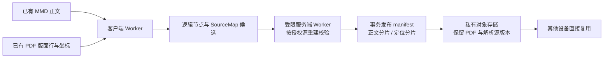
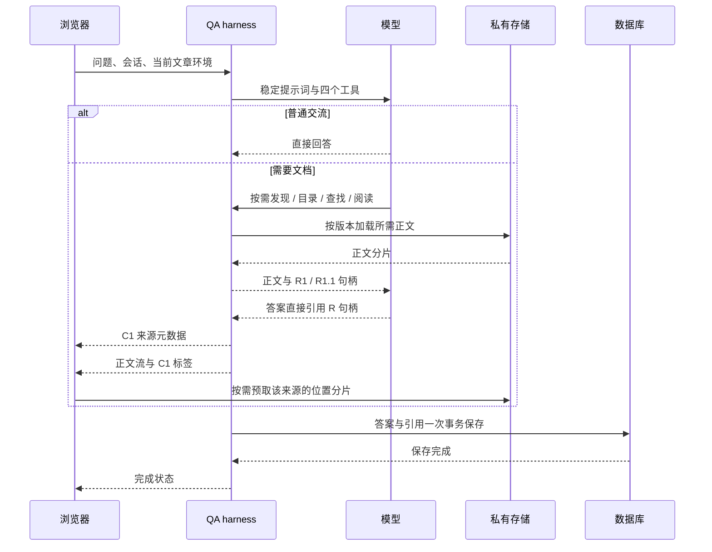

# 版本化正文、已读句柄与原文定位

实现版本：应用 `0.3.0-alpha.5` / QA `0.5.0-alpha.5`，运行路径 `workspace-artifacts-v1`。模型选择阅读位置和重要内容；软件负责保存其读过的范围、映射原文和展示引用。

## 文档准备：每个内容版本复用

MMD 提供自然段、显式章节、表格、列表、公式和代码；版面提供物理位置。`moderate` 可以在正文中保持正常词形，同时映射到 PDF 的 `mod-` 和 `erate` 两行，不要求模型复现断行。对齐使用局部上下文与确定性规则，歧义保留为未映射；不会通过全局去空格或模糊匹配强行生成精确坐标。

`revision` 由 PDF、正文、版面及构建规则版本决定。节点 ID 表示该版本中的出现位置；正文里的 UTF-16 半开区间通过 SourceMap 指向物理区域。传输文件可以合并多个节点，文件大小不决定引用粒度。

准备使用已有解析结果，不自动付费 OCR。客户端 Worker 可取消、按批次保存断点；服务端校验使用独立有界任务池。首次打开且尚未发布时需要准备，后续设备和问答复用已发布内容。

## 一次问答：读取和引用

四个工具是 `discover_documents`、`document_outline`、`search_document`、`read_document`。不存在必经的“结束阅读”或“标记引用”工具。章节句柄 `S1` 用于导航，实际读到正文后才有 `R1`；适合拆句的段落还提供 `R1.1`。标题、摘要和搜索内部扫描的文字都不自动成为已读证据。

句柄绑定用户、运行、文档版本、节点和已返回范围。相同范围复用句柄；跨用户、旧运行或未读范围不能引用。模型输出 `[R1.1]` 后，harness 按首次使用顺序生成 `[C1]`，先发送来源再发送标签。无效句柄最多一次纠正，修正尝试清空上一次的正文和来源。此校验证明引用属于实际已读内容，不等于判断论断是否被原文充分支持。

## 点击引用：客户端完成定位

浏览器使用来源中的版本、节点和范围，只下载覆盖该范围的位置分片。内容摘要验证和 SourceMap 解析在客户端完成；同 PDF 且内容已缓存时，点击直接滚动并高亮，不必再次让模型检索或等待答案保存后的引用 UUID。

跨文章先打开对应 PDF；当前 PDF 已替换时，打开保留版本的临时只读阅读器，保留当前文章状态。缺少坐标时只在有依据的情况下跳页；没有可信页码时来源不可定位。当前提供行/块高亮，没有实现逐字裁剪高亮。

冷缓存、跨文章 PDF 下载与旧版本鉴权仍有网络耗时。位置预取与答案流并行，消除的是必经的串行检索/保存等待，不承诺网络操作零耗时。

## 多用户下的职责和额度

| 执行方 | 主要职责 | 当前边界 |
| --- | --- | --- |
| 浏览器 Worker | 构建正文/映射候选，断点准备 | 本地候选最多 8 项，估算 64 MiB |
| 浏览器主线程 | 流式引用、按需加载、PDF 跳转与高亮 | 内容缓存 128 项/估算 24 MiB；下载最多 4 路 |
| 私有对象存储 | 正文、位置和保留版本传输，鉴权 | 不通过 QA API 中转每次位置下载 |
| 服务端准备池 | 独立重建验证，原子发布 | 每进程 1 个执行、2 个等待；Worker 256 MiB/60 秒 |
| QA 问答服务 | 鉴权、工具、句柄、模型调用、持久化 | 每进程 2 个执行、8 个等待；每用户 1 个活动请求 |
| QA 正文缓存 | 合并读取、重复使用不可变分片 | 256 项/估算 32 MiB；不缓存授权结论 |
| 数据库 | 版本发布、最终所有权校验、答案/引用事务 | 按涉及文档去重检查，不逐引用往返 |

单次问答最多读取 8 篇文档、返回正文 96,000 字符、展示 32 项引用；一次阅读最多 14,000 字符/32 节点。字面检索单次扫描最多 128,000 字符、整轮最多 1,000,000 字符。准备、缓存和问答上限分别生效，不能仅靠模型 token 预算保护服务器。

主动删除文档后，新的 API/存储鉴权请求拒绝访问；已经下载到设备的字节无法远程收回。历史版本达到用户存储上限时停止新增，不自动清理旧引用。多进程部署需另接共享队列；本轮没有分布式总限额或生产容量承诺。

实现入口：`shared/qaDocumentArtifact.mjs`、`shared/qaDocumentBuilder.mjs`、`server/qa/documentArtifacts/`、`src/qa/documentArtifacts/`。测试与部署状态见 [验收记录](qa-document-artifacts-acceptance.md)。
