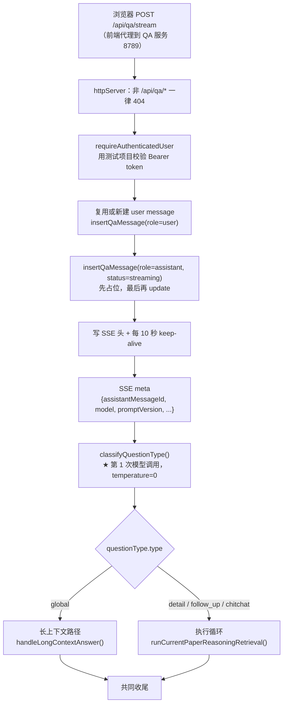
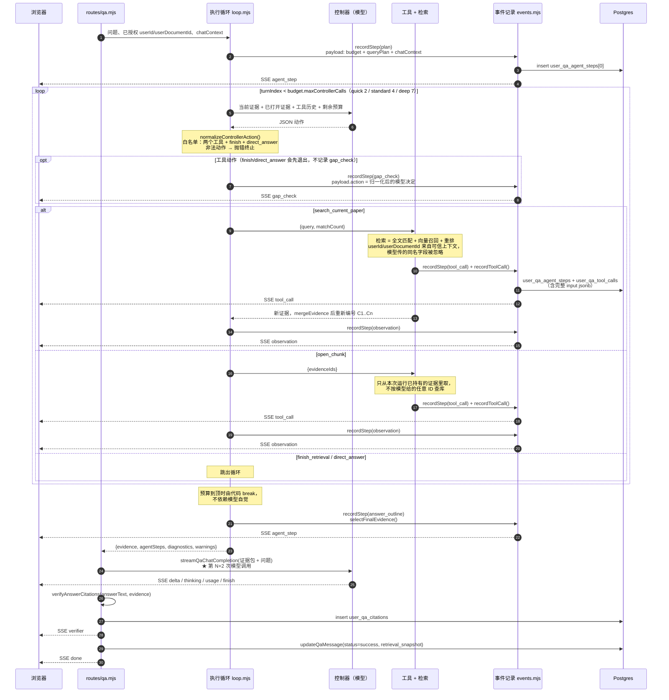
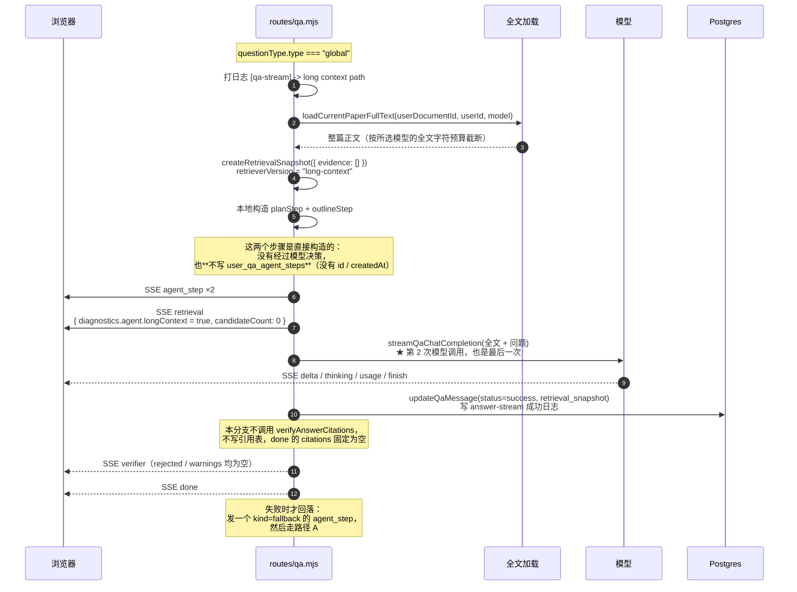

# 一次 QA 请求的逻辑图

`QA_AGENT_RUNTIME=document-tools-v1` 的新流程是：解析来源授权 → 原生工具规划循环 → `finish_reading` 原文匹配 → 禁用新工具的最终回答 → 引用校验与保存。无需 QA 索引、embedding 或 rerank。详细实现见 [P2 实施记录](qa-agent-stage-2-implementation.md)。下文为 `legacy-json-v1` 的旧检索/全文流程，保留作为对照。

对着 `server/routes/qa.mjs`、`server/qa/agent/loop.mjs` 和 `server/qa/queryRouter.mjs` 画的实际流程。
这是**逻辑**（任何一次运行都成立），不是某次运行的数据；具体查询词、证据编号、轮数因问题而异。
全文读取字段已在 `0.1.1-alpha.1` 修复。下面的事件持久化缺口仍是现状，
[F02 失败记录方案](qa-execution-observability-plan.md) 描述这些缺口的后续处理，不能当作已实现行为。
本文保留已验收旧路径的实际流程；[P2 工具自主查阅方案](qa-agent-stage-2-plan.md) 为尚未实施的新路径。

`detail` 与 `global` 是两条完全不同的路径，差别在第 6 步那一个分支。

## 共同前置：两条路径都走这一段



第 1 次模型调用就是路由器，它的原始返回打在终端 2 的 `[query-router]`，最终分流结果打在 `[qa-stream] questionType =`。

## 路径 A：`detail` 问题 —— 进执行循环



**正常检索回答的模型调用次数** = 1（路由）+ 循环轮数（≤ `maxControllerCalls`）+ 1（答案生成）。
一次 `deep` 提问最多 7 轮控制器，对应最多 9 次调用；无证据时可以直接返回固定说明，省去答案模型。
若全文生成已经调用过模型再回落，还需计入失败尝试，不能用此公式推算所有请求。

## 路径 B：`global` 问题 —— 绕过循环



**这次请求的模型调用次数** = 2（路由 + 全文答案）。**没有任何 `tool_call`。**

## 两条路径的差别

| | 路径 A（detail） | 路径 B（global） |
| --- | --- | --- |
| 触发条件 | `questionType.type !== "global"` | `=== "global"` |
| 进入执行循环 | 是 | **否** |
| `tool_call` 事件 | 有（≤ `maxRetrievalCalls` 次检索 + ≤ `maxOpenCalls` 次打开） | **没有** |
| `gap_check` 事件 | 工具动作有；finish/direct_answer 没有 | 没有 |
| `retrieval` 事件 | 有，包含证据快照 | 有，evidence 为空 |
| 证据来源 | 向量检索 + 重排，逐轮累积 | 无（`evidence: []`） |
| 可点回的引用 | 有，`citationVerifier` 逐条校验 | **没有**；本分支不执行引用校验 |
| 模型调用次数 | 1 + 循环轮数 + 1 | 2 |
| **步骤是否落库** | **是**，每步写 `user_qa_agent_steps` | **否**，只走 SSE |
| 失败行为 | 抛 `QaAgentRunnerError`，带已完成步骤 | 回落到路径 A |

注意最后第二行：路径 B 的 `plan` / `answer_outline` 是本地构造的对象，**没有 `id` 也没有 `createdAt`**，
从不写库。所以对它跑 trace 脚本时第 1、2、3 节会是空的——**这正是区分两条路径最快的办法**。

## 怎么用真实数据核对这张图

上面是逻辑。要把你**实际那两次**的查询词、证据编号、轮数填进来，跑：

```bash
# 最近一次
psql -p 5432 -d postgres -f scripts/qa-trace.sql

# 指定某次
psql -p 5432 -d postgres -v msg_id=<uuid> -f scripts/qa-trace.sql
```

| trace 的哪一节 | 对应图里的什么 |
| --- | --- |
| 第 0 节 | 共同前置：确认 `model` / `prompt_version` / `usage` |
| 第 1 节 | 路径 A 的完整步骤时间线；**路径 B 这里为空** |
| 第 2 节 | 路径 A 的循环体：`turn` / `model_action` / `rewritten_query` |
| 第 3 节 | 路径 A 的 `tool_call` 几步：入参、返回证据、耗时 |
| 第 4、5 节 | 证据 C 编号 → chunk → 正文 |
| 第 6 节 | 收尾的引用校验产物 |

这份文档描述代码逻辑；两轮的实际步骤数、工具调用、耗时与引用已在
[2026-09-23 本地真实运行核验](qa-local-runs-2026-09-23.md) 中按数据库记录核对。

## 读真实轨迹时的四个陷阱

下面四条是拿一次真实运行核对这张图时才发现的，光读代码不容易注意到。

### 1. `C1` 在不同步骤里可能指不同的证据

`mergeEvidence()` 最后一步是**按分数降序重新编号**：

```js
return deduped
  .sort((left, right) => Number(right.score) - Number(left.score))
  .map((item, index) => ({ ...item, evidenceId: `C${index + 1}` }));
```

`plan` 之前，`normalizeCarryoverEvidence()` 已先对带入证据排序并从 C1 重新编号，并非保证沿用上轮编号；
`observation` 之后又变为**本次合并重排后的新编号**。同一个 `C1`，在两个步骤里未必是同一条 chunk。
比对时要认 `chunk_id`，不要认 `C` 号。

### 2. `finish_retrieval` 不留任何步骤

`loop.mjs` 里判断在记录之前：

```js
if (action.action === "finish_retrieval") { finishAction = action; break; }  // ← 先跳出
await events.recordStep(state, "gap_check", { ... });                        // ← 走不到
```

于是**模型"决定收工"这个动作在步骤时间线里是查不到的**，只能从 `answer_outline` 的
`payload.answerOutline` 反推（它就是 finish 动作带回来的大纲）。

只有已确认最后一轮为 finish、且前面每个工具动作均留下 gap_check 时，才能按 `gap_check + 1` 推断轮数。
预算耗尽、异常或其他终止条件不满足这个等式。当前 `diagnostics` 有 retrievalCalls / stepCount，
但没有实际 controllerCalls，不能从中直接读取精确控制器次数。

### 3. 光看数据库分不清路由选了哪条路

一个问题走**路径 A**，有两种可能：

- router 判成 `detail` / `follow_up` / `chitchat`，直接进循环
- router 判成 `global`，但长上下文失败，**回落**进循环

两者的数据库痕迹**完全一样**。因为回落的那个 `kind: "fallback"` 步骤只 `writeSse`，
从不落库——而且它写的是 `stepIndex: 0`，与循环的 plan 步骤撞 `unique (message_id, step_index)`，
这也反证了它没落库。

唯一判据在服务端日志：

```
[query-router] {"normalizedType":"global", ...}
[qa-stream] questionType = global | question: ...
[qa-stream] -> long context path        ← 有这行才是真的走了长上下文
```

#### 实测案例：路由判对了，但长上下文失败了

一次真实运行里，`「这篇文章主要讲了什么？」` 的日志是：

```
[query-router] {..."normalizedType":"global","confidence":"high"...}
[qa-stream] questionType = global | question: 这篇文章主要讲了什么？
[qa-stream] -> long context path
[qa-stream] evidence lineRegions check: [ ...C1..C10... ]     ← 这行属于 agent 路径
```

路由**判对了**（global，high 置信度），也确实进了长上下文路径，但随后出现了属于 agent 路径的日志
——说明长上下文抛错并静默回落了。数据库里只看得到 agent 循环的痕迹，看不出发生过回落。

**失败原因是不可观测的**：回落处既没有 `console.error`，也没有写库，
`errorMessage` 只存在于那一刻的 SSE 流里（渲染时前端只显示 `summary`，所以界面上也看不到）。
要当场看到它，可以开浏览器 DevTools → Network → `/api/qa/stream` 的 EventStream。
后续已通过同文档只读复现定位到全文读取的字段不匹配，并在 `0.1.1-alpha.1` 修复；
这不等于找回了该历史请求的异常。新版本的持久化回落记录仍待 F02 实施。

该请求的 `chatContext.carryoverEvidenceIds = ["C1","C2"]` 只能证明加载过历史非空证据。
`findLatestCarryoverEvidence()` 会跳过空快照，向前找同一文档最近一次非空证据，因此即使紧邻上一轮
成功走了长上下文，仍可能从更早的回答带入证据。本次查库确认两条证据来自第一轮，
且两轮最终均为 Agent 路径；但没有第一轮的路由日志，**不能断言第一轮也发生回落**。
原先“两轮都回落、系统性失败”的结论已撤回，详见 [实际核验记录](qa-local-runs-2026-09-23.md)。

### 4. agent 路径的 `questionType` 不落库

`questionType` 只出现在两处：`console.log`，以及长上下文路径的步骤 payload / diagnostics。
`user_qa_api_logs` 的 payload 只有 `chatContext` / `diagnostics` / `evidenceCount` / `queryPlan` / `warnings`。

所以"这个问题为什么没走长上下文"**事后无法从数据库回答**，必须翻服务端日志。
这是当前的一个可观测性缺口。
