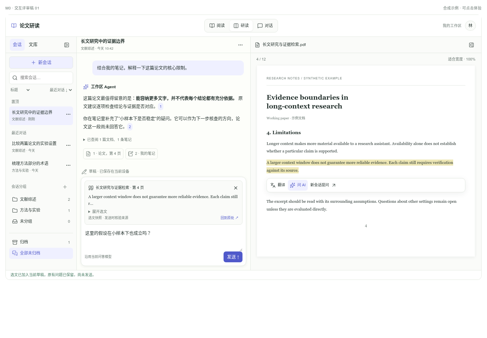
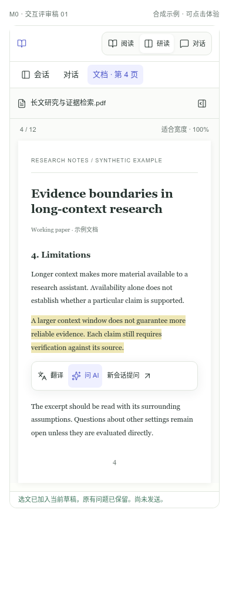

# 工作区 Agent M0：推荐方案与交互冻结候选

日期：2026-09-26。状态：**M0 已启动，第一轮冻结候选已交付；尚未完成产品评审与量化预算测定，不标记 M0 完成。**

本轮承接[升级计划](qa-workspace-agent-upgrade-plan-2026-09-26.md)，从 `fc091e69c0343f77743c7296f4a441030849606a` 核对现状。交付推荐决策、视觉稿、资源与协议候选、固定评测集和现有离线基线。生产功能、数据库、版本和服务配置均未改变。

## 1. 推荐采用的方案

沿用当前研读工作区：**左侧会话/文库导航 → 中央对话 → 右侧 PDF → 按需展开的批注**。暖白底色、靛蓝强调、对齐的无边框收展按钮和顶栏“阅读 / 研读 / 对话”保持一致。新增能力在对应区域就地呈现。

| 选择 | 推荐行为 | 需要冻结的边界 |
| --- | --- | --- |
| 会话组织 | 单层手动分组 + 置顶 + 归档；默认按最近对话排列 | 一会话最多一个分组；分组与文库集合分开；删除分组不删除会话；首期无拖拽排序 |
| 找回会话 | 标题/消息搜索，分组/归档/关联文档筛选，最近/创建/标题排序 | 置顶仅在匹配范围内优先；分组是筛选入口，避免重复列出同一会话；明确真实续页 |
| 自动标题 | 首个成功回答保存后生成一次；首问摘要立即可见 | 手动标题、legacy 默认保护；标题调用独立计量；标题变化不改变活动排序 |
| 选文“问 AI” | 默认加入当前草稿，显式可选新会话，主动发送 | 保留原问题与附件；不自动提问；生成中进入下一条草稿 |
| 选文卡 | 显示文档、实际页列表、摘录、来源状态；可展开/移除/定位 | 选中文字与补充上下文分开；云端文件不等于选文已核验；晚到 OCR 不改写快照 |
| 本地资料 | 按需读取当前设备有归属的资料，显示覆盖限制 | 无主旧记录不自动归当前账号；不因查询自动上传 PDF、触发解析或全库同步 |
| Agent 访问 | 增加概览、查询、读取、统计、关联五类通用只读工具 | 保留原文专用阅读和引用；身份、预算、来源、分页由服务端约束 |
| 任务持续运行 | 本批保留普通问答的取消语义 | M6 再完成持久恢复；后台持续研究另行明确，不随会话保存隐式开启 |

选择理由：当前代码已经提供三种布局、会话历史、引用跳转和独立 QA 执行循环。M0 应把新的资源与交互接在这些基础上，优先解决“找得到资料、分清来源、保住输入”，再推进长期上下文与故障恢复。

## 2. 桌面视觉与交互

视觉稿使用合成文章、笔记和回答，所有点击只操作演示状态，不连接业务 API 或模型。它用于评审 M1–M3 的目标体验，不表示界面中的功能已经接入产品。

桌面 1440px 推荐导航仍以现有 240px 为基准，允许用户调整；研读余下空间按现有聊天约 43% / 文档约 57% 起始分配。内嵌稿为适配较小展示宽度压缩导航，实际接入沿用 ReaderShell 的面板约束。窄到现有 920px 断点时转单内容视图。

1. 会话页顶部放新建、搜索、紧凑搜索范围/排序；分组作为独立导航入口，归档位于列表底部。更多筛选可以放入紧凑弹层，避免挤占全局顶栏。
2. 会话项统一使用 `…` 菜单：改名、重新生成标题、置顶、移动、归档、删除。触屏也能直接看到入口，不依赖 hover。
3. 自动标题只改变导航名称；手动命名后显示在菜单中的保护说明，不在每条消息旁增加状态噪声。用户主动重生只授权替换发起时版本的标题。
4. 选文操作保留翻译入口；“问 AI”是主要交接动作，“在新会话提问”是次级动作。窄屏现有选择操作已较多，产品实施应使用更多菜单/两层操作，避免横向硬塞。
5. 引用卡位于问题输入框上方。默认显示短摘录，展开后区分选文和上下文；文件未同步时写“用户提供的选文”，不写“已核验原文”。
6. 输出来源区分论文、个人笔记、历史消息和查询口径。正文引用点击回到 PDF，笔记来源展开对应笔记。过程继续默认折叠。

原型可演示搜索、排序、分组、归档恢复、改名、标题重生、删除撤销、选文加入当前/新草稿、移除、展开、定位和演示发送。设计调节可切换窄屏、下一次选文来源、第一/第二选区以及当前回答生成中状态。

## 3. 窄屏视觉与交互

| 文档选文 | 加入草稿 | 会话管理 |
| --- | --- | --- |
|  |  |  |

窄屏每次只展示会话导航、对话或文档之一；研读模式保留对话/文档切换。阅读/对话模式中的跨区域跳转同步模式状态，避免顶栏与正文不一致。

- 在第 4 页选文后点击问 AI，切到对话并显示引用卡；点击“回到原处”返回第 4 页，问题文字保持原样。
- 打开会话导航后选择另一会话，只切对话，不切 PDF 文件或页码。
- 生成中仍可编辑下一条草稿，发送按钮保持等待当前回答结束；现有停止功能在产品中继续对应当前 run。原型只演示草稿状态，不模拟真实流式过程。
- 键盘可以访问主要按钮和输入；菜单支持 Escape 关闭。定位/收展不能依赖拖拽或 hover。

## 4. 关键状态与验收规则

| 触发 | 应看到/保存的结果 | 禁止的结果 |
| --- | --- | --- |
| 已有草稿，点问 AI | 原问题保留，追加不可变附件 | 覆盖草稿或自动提问 |
| 同一交接事件重复到达 | 按快照身份去重 | 同一附件重复添加 |
| 选择另一段 | 添加独立附件；每件可分别移除/展开 | 只保留最后一段或拼成不可分文字 |
| 当前回答生成中 | 新选文进入下一条草稿 | 修改当前 run 输入 |
| 未解析或本地 PDF | 可提交用户选文，来源状态清楚 | 自动上传、付费解析或伪称原文已核验 |
| 无文字 | 明确提示，保留操作上下文和既有草稿 | 生成空引用卡 |
| 发送后继续输入，迟到成功/失败 | 保存当时消息快照；保留后续草稿修订 | 清空新输入，或失败恢复覆盖新输入 |
| 历史重生 | 使用原用户消息及附件/环境，重新验权 | 使用当前文章、当前选区或最新草稿 |
| 自动标题到达前用户改名 | 手动名称获胜 | 旧任务覆盖新标题 |
| 归档/删除/撤销 | 归档可恢复且与删除分开；删除/恢复递增生命周期版本 | 撤销后重新接收删除前旧标题任务 |
| 本地同 fingerprint、两个账号 | 只读已验证归属的记录 | 当前账号登录即接管旧数据 |
| 查“总共几篇” | 数据库聚合，给口径/时间/覆盖 | 把一页数量、跨设备不全结果当全库总数 |

原型是交互示意，**不用于证明**上述版本并发、身份权限、刷新/跨设备持久化、真实 PDF 几何定位或请求幂等性。它们必须由后续代码、数据库测试和真实浏览器流程验收。

本轮已用本机 Playwright 检查草稿保留、重复交接、新会话与原草稿、空问题禁止发送、已发送附件、改名、归档恢复、删除撤销和阅读模式导航，并检查 320/390/920/1024px 视口无横向溢出；浏览器控制台无错误。详见[原型检查记录](fixtures/qa-workspace-m0-visual-review-2026-09-26.json)。原型状态检查不计为产品功能验收通过。

## 5. 技术冻结包

- [资源与协议候选](qa-workspace-agent-m0-contracts-2026-09-26.md)：云端/本地资源矩阵、五类工具、字段白名单、覆盖与游标、来源、选文附件、消息 revision、标题原子条件提交和草稿冲突处理。
- [设计 JSON Schema](contracts/qa-workspace-m0.schema.json) 与[合法/非法样本](contracts/qa-workspace-m0.examples.json)：只用于契约验证，当前运行时没有加载这份新协议。
- [固定评测集与实测边界](qa-workspace-agent-m0-baseline-2026-09-26.md)：双用户、分页、计数交并、来源、选文、标题竞态、本地归属、长会话与恢复故障。
- [机器可读基线结果](fixtures/qa-workspace-m0-baseline-results-2026-09-26.json)：被测 SHA、环境、逐文件结果与历史轨迹差异。

建议把附件限额先作为可验证候选：最多 4 件，单件选文 4,000、选文合计 12,000、补充上下文合计 4,000 个 UTF-16 单位；问题仍单独限制 2,000。超限明确提示，不静默截断。模型 token 和 HTTP 字节数另计，必须通过样本测量后再冻结最终阈值。

## 6. 本次 M0 状态与剩余出口

| 出口 | 当前状态 | 后续动作 |
| --- | --- | --- |
| 资源/操作/归属/覆盖矩阵 | 已交付候选 | 结合产品评审冻结首批开放范围 |
| 操作、来源、附件、revision 等契约 | 已交付候选及样本校验 | 审定字段与预算后记录正式版本 |
| 桌面/窄屏交互 | 已交付可交互稿 | 确认布局、会话组织、选文交接；据反馈修订同一稿 |
| 固定数据与目标预期 | 已交付 38 个案例 | 后续按 M1–M7 绑定实际 runner；不提前计通过 |
| 当前 QA 离线基线 | 197 条通过 | 保留现有回归出口 |
| 旧 runner 轨迹比较 | 3 一致、4 既有扩展差异 | 解释新增 action/stopReason 并维护旧守卫；不得洗成通过 |
| 目标机器性能、数据库计划 | 未测定 | 在隔离实例/测试库测首字/总耗时、查询/聚合、队列、RSS、缓存量 |
| 标题真实模型预算 | 未测定 | 固定问题/回答样本，界定费用后实测 token、超时、失败行为 |

因此本次准确状态为 **“M0 冻结候选 v1 可评审”**。产品选择确认且必需基线补齐后，才将 M0 标记“契约冻结”，再启动 M1/M2 运行时代码。

下一阶段推荐按依赖推进：M1 统一云端资料访问与来源保存、M2 会话管理与持久草稿并行；合并这两项基础后完成 M3 选文输入。M4–M6 继续沿原计划推进，不把来源卡视觉完成当作全部资料接入、长会话或任务恢复已交付。

## 7. 源码核对依据

- `src/styles/workspace.css`：面板顺序、43% 起始比例、920px 窄屏断点、对称收展与内容标题栏。
- `src/app/ReaderShell.tsx`：布局路由、切会话不切文章、晚到 MathPix 对选择状态的更新。
- `src/qa/WorkspaceChat.tsx`：现有会话操作、组件内草稿、30 条 offset 分页。
- `src/qa/PaperQaPanel.tsx`：生成中输入禁用现状；M3 下一条草稿需要单独状态。
- `src/pdf/PdfViewer.tsx`、`src/mathpix/mathpixSelectionResolver.ts`：多段主 pageIndex 不是完整页集合；整行替换和不可变快照边界。

这些依据来自本轮本地源码核查；未据此声称线上已经开启升级功能。
