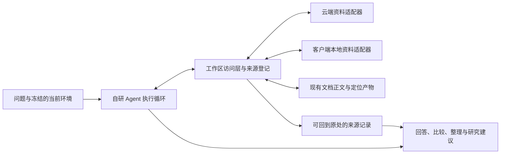
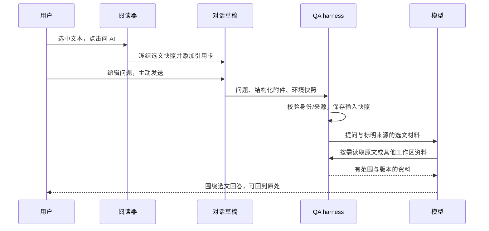

# 工作区 Agent、会话管理与选文问答升级计划

日期：2026-09-26。状态：**规划草案，供审阅；本轮仅交付文档，尚未开始新功能实施。**

目标是让模型按需发现、查询、读取、关联和综合用户工作区中的有用信息，同时提供易管理的会话和“选中文本 → 问 AI”入口。文库篇数、文章分类是验收案例，不能成为信息访问能力的边界。

本计划承接自研 Agent 的原始六步路线，保留已经验收的工具协议、版本化原文和引用定位。模型负责选择资料、比较和综合；harness 负责身份、权限、预算、来源、持久化和原文映射。继续减少对 embedding、固定检索 chunk 和 rerank 的依赖。

## 1. 基线与原始六步路线的承接

代码核查基线为 `1ecddaf9e1fbfdc6edfa83d709d36df08dfbb9ea`；最近生产发布源码为 `acee99ea83f131fa40134e0fe02bccddebc7f363`，应用 `0.3.1` / QA `0.5.1`，运行路径 `workspace-artifacts-v1`。生产状态引用 [修复发布记录](qa-citation-reliability-2026-09-26.md)，本轮未重新执行线上业务验收。

以下顺序已对照最初的 Agent 学习与升级讨论；它与早期故障修复 F01/F02/F03、文档产物 S1–S5 是不同编号体系。

| 原顺序 | 原定内容 | 当前可确认的基础 | 本计划承接 |
| --- | --- | --- | --- |
| 1 | 拆分执行循环、模型适配、工具注册和事件输出 | 已完成；版本和独立 QA 交付流程已经落地 | 沿用边界，为资源适配器、辅助任务和客户端工具增加接口 |
| 2 | 接入工具调用协议、参数校验、工具结果回传 | 原生工具循环、参数校验、错误回传和过程输出已实现 | M1/M4 扩展资源类型和客户端结果回传，保持协议可学习、可追踪 |
| 3 | 加入章节、页码和邻接片段读取 | 已有目录、页范围、来源所在段落补读、续读及版本化引用；通用邻接导航仍可扩展 | M1/M3/M4 把阅读扩展到笔记、消息窗口、选文及其上下文 |
| 4 | 管理上下文、证据和会话摘要 | 文档证据较完整；上下文仍为当前会话最近 12 条消息，没有持久会话摘要 | M2/M3/M5 完成会话组织、输入附件、摘要和可追溯研究上下文 |
| 5 | 加入持久任务、检查点、重试与取消 | 已有请求内预算、取消、有限修复和日志；没有完整的崩溃恢复/检查点续跑 | M6 补齐持久执行，不能把保存聊天记录视作恢复执行 |
| 6 | 扩展跨论文任务并建立评测 | 已支持多文档查阅及引用，并有回归与负载检查；跨工作区资源综合尚未交付 | 所有阶段持续评测，M7 验收跨资源任务与正式发布 |

原阶段证据见 [P1 收尾](qa-agent-stage-1-closeout.md)、[P2 实施](qa-agent-stage-2-implementation.md)、[工作区会话](qa-workspace-agent-plan.md)、[文档产物](qa-document-artifacts-plan.md)。历史文档中的“当时未上线”保留历史含义，不作为当前交付状态。

## 2. 工作区信息范围与事实边界

| 资源 | 已有数据 | 本轮开放方式与边界 |
| --- | --- | --- |
| 文档与书目 | 标题、作者、年份、发表源、标识符、摘要、目录、正文、表格、解析状态 | 元数据筛选与正文阅读；已采纳元数据和待确认建议分开 |
| 文库组织 | 层级集合、扁平标签、阅读状态、收藏、归档 | 精确查询、集合浏览、分组统计；一文可多集合/多标签 |
| 批注、笔记、高亮 | 同一批注记录中的摘录、笔记、颜色、译文、页和区域 | 跨文档搜索和读取；保存的笔记、原文快照和译文分别标记来源 |
| 翻译与术语 | 划词译文缓存、文档术语/风格；自由翻译历史与草稿 | 查找、复用、译法比较；用户确认术语与自动建议区分 |
| 历史会话 | 用户消息、模型回答、引用、时间、状态 | 跨会话查找、读取相邻消息、沿引用回读原文；历史回答不是新的论文证据 |
| 阅读与当前环境 | 当前文章、选区、页、上次位置、阅读状态、最近打开信息 | 明确“这段/这几篇”的指代，找回阅读位置；当前快照不等于阅读轨迹 |
| 会话组织与偏好 | 现有置顶/手动标题；语言及文档翻译约定 | 本轮增加会话分组、归档、排序；仅在相应任务中应用明确偏好 |
| 可用性与使用统计 | 解析/同步/请求状态及部分调用统计 | 解释资料不可用，按需汇总可观察记录；原始诊断日志不作为默认研究资料 |

覆盖的是用户业务资料与任务相关状态。云端已有数据、本机尚未同步数据、已裁剪的历史分别返回覆盖范围；未接通或不可用不能返回一个容易被误解为“没有任何记录”的空列表。

目前自由翻译历史只保存在当前浏览器，最多 50 条/100 万字符；API 日志不能还原其正文。阅读位置是覆盖更新的状态，没有阅读时长、逐页阅读或完成时间序列。本轮不据此推导“上周读完几篇”或真实完成率，也不隐式增加阅读遥测。

## 3. 统一访问层与模型分工

### 3.1 信息对象与操作

每类资源注册受控适配器，声明可搜索字段、过滤/排序/统计维度、读取方式、明确关系、版本与定位方式。模型面对文档、笔记、消息、译文等业务对象，不接触数据库表、对象存储路径或用户身份参数。

工具按下列操作组织，具体名称和 JSON Schema 在 M0 冻结；不以固定六个工具限制后续资源接入。

| 操作 | 内容 | 组合示例 |
| --- | --- | --- |
| 概览/浏览 | 资源种类、可用范围、集合/会话分组、分页目录 | 了解工作区有哪些可用材料 |
| 查询 | 精确标识、字段条件、关键词、时间范围、交集/并集、排序 | 筛选某集合中未读完的文档，再找相关笔记 |
| 读取 | 记录详情、原文范围、相邻消息、选文上下文 | 从命中摘要展开足够上下文 |
| 统计 | 精确总数、分组、分布、明确范围内的交集 | 汇总分类、未读情况或记录数量 |
| 关联 | 沿已保存的关系找到关联对象 | 笔记 → 文档 → 原文；历史消息 → 引用 → 文档 |

保留适合 PDF 的目录、章节/页范围和已读来源补读工具。比较、归纳、解释和规划由模型组合以上能力完成，不为每个问题添加一个专用业务工具。

跨文档相关主题可作为候选关系返回；同一回答引用过两篇文章不证明它们互相引用、支持或反驳。当前参考文献关系表没有完整读取/匹配链路，本计划不把它当作现成关系图。

### 3.2 查询与结果契约

- 用户身份、会话权限、资料可见性由执行上下文注入；输入仅允许白名单业务字段，模型不能提交 SQL 或任意查询表达式。
- 文档、笔记、译文和历史消息作为带来源的资料读取，不提升为本轮指令；旧消息中的请求不自动触发新任务。首期自主开放查询和阅读，修改、移动或删除用户资料仍由明确用户操作触发。
- 列表、计数、分组使用同一过滤语义。显式区分当前页数量和匹配总数、未归档/归档/合计、直接集合/包含子集合、标签 ANY/ALL；关联表按文档身份去重。
- 概览和统计按需调用，不强制每次提问先扫描工作区。只查数量时不读取 PDF 或逐条拉取正文。
- 简明候选卡先返回；完整摘要、译文、笔记和历史消息按需读取。结果包含来源类型、版本/更新时间、查询范围、可用性、截断/续页及统计时间。
- 句柄绑定用户、当前运行、资源版本与实际读取范围；游标绑定过滤条件及排序。跨请求内容变化需声明分页一致性，不能把普通 offset 宣称为固定快照。
- 模型上下文和 UI 投影分别生成；来源卡可打开 PDF、笔记或消息，查询统计可展开口径。现有过程默认折叠、最多两处位置的体验继续保留。
- 现有 `R/C` 原文引用继续有效；新增记录/查询/选文来源使用明确类型及独立登记。来源预算和权限检查覆盖所有类型，不能借新来源绕过上限。
- 元数据回答、个人记录回答、文档事实和混合回答分别记录实际资料使用，不再仅以“是否返回正文字符”把所有查询归为普通交流。

### 3.3 客户端、服务端和缓存

客户端负责当前环境/选区快照、本地资料查询、草稿、正文准备 Worker 和界面定位；数据库负责受限筛选/聚合；QA 服务负责调用编排、授权、预算、来源验证、模型调用和保存。

本地查询通过 M4 的受控通道接入，服务端不直接读取浏览器数据库。响应绑定用户、run、requestId、期限与声明的数据范围；处理重复、取消、迟到、客户端离线和多标签页。客户端提供的文字可作为用户资料，不能据此自证为服务器已核验的论文原文。

现有部分本地仓储仅按 PDF fingerprint 存储，没有用户归属。M0/M4 必须补用户隔离存储或可验证的归属映射：云端关联资料核验所有权；遗留无归属记录不能仅因当前账号登录就自动纳入查询。本地独有旧资料通过明确的导入/归属操作接入，用户主动提交的选文则按本次输入处理。回传请求绑定用户不能代替记录本身的归属检查。

M0 建立“资源 × 云端/当前设备 × 可发现/可查询/可读/可统计 × 归属 × 覆盖限制”矩阵。除表中云端资料外，还逐项核对本地 PDF、已缓存页文本、已解析 MathPix 页面、划词译文缓存、自由翻译历史/草稿、未同步批注/术语和会话草稿。M4 依据矩阵接入，不以几个示例代替完整范围；不接入的内容及原因明确记录。缺少缓存或解析产物只返回可用性，不因此上传整份 PDF 或触发新解析。

固定提示词与工具定义保持稳定，动态资料按需追加。缓存按用户、资源版本和规范化查询隔离；客户端未同步修改与云端版本不能静默互相覆盖。缓存容量、扫描量、返回字符量和并发均有上限。先复用字段索引与词法搜索，不增加默认 embedding/rerank；中文、英文、跨语言关键词改写的召回分别评测。

## 4. 里程碑总览

所有新里程碑当前均为**计划**；M0 本文只完成草案，交互稿和实施契约尚待冻结。每步交付设计说明、代码/迁移、必要测试、脱敏轨迹、局限和回退指针。

| 里程碑 | 主要交付 | 依赖 | 可验收的出口 |
| --- | --- | --- | --- |
| M0 范围、契约与交互冻结 | 逐类资源/操作/归属矩阵、操作 Schema、来源/附件格式、会话管理和选文交互稿、固定评测集与基线 | 本文审阅 | 产品选择与技术契约明确；新功能未启用，基线可以重现 |
| M1 云端工作区访问 | 统一仓储/适配器；文库、组织、笔记/高亮、译文/术语、历史问答的查询/读取/统计/关联；多类来源保存与展示 | M0 | 所有上述云端资源至少跑通一个组合任务；计数准确、可回到来源、跨用户隔离成立 |
| M2 会话标题与管理 | 后置自动标题、手动保护、会话分组/归档、排序/筛选/搜索、可靠分页、持久草稿基础 | M0；可与 M1 并行 | 会话易找回、标题不抢改、不扰乱活动排序；旧历史与草稿保留 |
| M3 选文“问 AI” | 弹框入口、不可变选文快照、输入引用卡、结构化附件保存、来源核验、历史/重生还原 | M1 来源基础 + M2 草稿/会话路由 | 选文进入当前或新会话草稿；零自动提问，原文/上下文分开，发送与重生不串资料 |
| M4 本地资料与即时环境 | 受控客户端工具通道；按资源矩阵接入本地资料、缓存和当前环境，补齐归属隔离 | M1 + M3 的快照基础 | 矩阵逐项验收；云端/本地联合任务、去重与同步冲突可解释；离线/关闭标签页有明确边界 |
| M5 会话上下文与研究连续性 | 持久版本化摘要、相关历史按需加载、用户明确目标/已记录疑问、预算压缩与源消息回溯 | M1/M2/M3；完整验收含 M4 | 超过最近 12 条仍能正确接续；删改/重生使旧摘要失效；历史模型结论不升级为原文事实 |
| M6 持久任务与恢复 | 任务状态、语义完整检查点、幂等提交、有限重试、取消/恢复、断流重连 | M5 | 进程重启与保存故障下不重复提交；已完成模型结果不被重新生成；不冒充供应商请求恰好一次 |
| M7 综合评测与分批发布 | 跨资源研究任务、真实模型/浏览器/多用户验收、兼容迁移与回退演练、正式发布记录 | 对应发布批次全部前置 | 每类资料、三条新增用户体验及故障矩阵通过；工程通过、人工验收、上线分别记录 |

建议实施顺序：`M0 → (M1 ∥ M2) → M3 → M4 → M5 → M6`。M7 的评测从 M0 开始贯穿全程，并作为每批发布出口。M1–M3 可先交付一批供使用，但只有 M4/M5 同样完成，才能称为完整工作区信息利用与会话连续性升级。

本计划采用出口条件而非未经估算的日历承诺；M0 完成接口和样本验证后，再估算各批工期。原六步中的第 5 步可以独立发布，不必阻塞先体验选文问答和会话管理。

## 5. M2：自动标题与会话管理契约

### 5.1 自动标题

当前实现是压缩首问空白后截取 80 字符，没有语义标题模型，也没有手动标题保护字段。拟采用“立即有临时标题，首个成功回答保存后异步生成一次语义标题”。

1. 新会话立即显示首问摘要；选文问题可加入短文档名帮助区分“解释一下”一类标题。点击问 AI、添加附件、未发送草稿均不触发标题任务。
2. 主回答和引用保存不等待标题。辅助任务只读取已保存的必要问题/短回答片段及附件主题，不读取全库或整篇 PDF，不运行 Agent 工具。
3. 默认沿用已有模型凭据，使用独立辅助模型配置、短输入输出和低并发；具体 token/超时预算由 M0 测定。普通问答仍是主回答 1 次模型、0 工具；标题可能另有 1 次辅助调用，必须单独记录，不能宣称总计仍只有 1 次调用。
4. 保存标题采用原子条件更新：用户、线程未删除、标题版本、任务 nonce、来源消息版本和本次覆盖许可全部成立才提交。默认自动任务不能覆盖手动名；手动改名同时递增版本并使旧任务失效，重复回调不重复写。
5. 自动标题默认只生成一次，后续消息不反复改名。用户可选择“重新生成标题”，仅对发起时的标题版本授权一次替换，可用于手动名或旧标题；任务之后的新手动改名仍使其失效，不永久解除保护。
6. 原问答再生/来源消息删除使在途旧任务失效；若删除了已完成自动标题的来源，撤下该自动标题并从剩余有效内容重建，没有有效内容则回到默认名称，手动标题保留。删除/撤销会话不接收删除前的迟到任务。
7. 模型错误、超时或配额紧张时保留临时标题。任务持久化、可限次重试；这套小型辅助任务机制可以先实现，M6 再统一执行可靠性。
8. 旧会话标题标记为 `legacy`，默认保留；不能根据“像首问截取”猜测它没有经过手动编辑。旧会话只在用户明确选择时重新生成，批量操作先展示数量与成本范围。

自动标题是导航名称；会话摘要是 M5 的上下文资料。二者分开存储、独立版本和触发，生成标题不代表摘要已完成。

### 5.2 管理、排序与界面

当前已有手动改名、置顶、软删除/撤销、标题搜索、每页 30 条列表以及“置顶/今天/更早”分段。升级应复用这些基础。

推荐交互：在现有左侧“会话”页签内提供**置顶、最近对话、单层会话分组、归档入口**，配一个紧凑的搜索与筛选/排序控件；较多分组可折叠。沿用两侧无边框且对齐的收展按钮，保持顶栏简洁，管理操作在会话项菜单内完成。M0 先交付桌面/窄屏视觉与交互稿供确认。

- 首期一个会话最多属于一个手动分组，保留“未分组”；删除分组只解除归属，不删除会话。文库集合与会话分组分开，不因会话移动修改文章分类。
- 模型可建议主题名，移动或批量整理由明确用户操作触发。归档是隐藏于默认列表的可恢复状态，与删除分开。
- 默认“置顶优先 + 最近对话”；支持创建时间和标题排序。置顶在各视图中的位置明确，首期不增加拖拽自定义排序。
- 新增 `last_activity_at`：用户消息提交和回答进入终态更新活动时间，不按流式 token 更新；标题生成、改名、分组、置顶不改变它。旧记录以现有 `updated_at` 作近似回填，不伪造历史。
- 标题搜索与消息正文搜索可区分，结果显示命中片段。支持分组、归档、实际关联文档过滤；M2 先基于已保存引用关联文档，M3 再加入输入附件关系并补验收，不能拿当前打开文章替代。
- API 返回真实 `hasMore/nextCursor`，游标绑定筛选/排序及身份，以稳定 ID 打破平局；切换条件重置游标，活动变化后刷新去重，不宣称跨请求完全静止的列表。
- 按用户及会话/本地草稿 ID 保存输入文字、附件和输入状态；退出/换账号不串草稿。切换会话不改变阅读文章和位置，保留当前工作区布局。

## 6. M3：选中文本 → 问 AI → 引用卡 → 发送

### 6.1 用户可见行为

- 选择操作弹框和翻译后的弹框都增加“问 AI”；无需先完成翻译。点击时仅打开问答并添加引用卡，不调用 QA 模型、不发送问题。
- 默认追加到当前会话草稿，提供“在新会话提问”。没有会话时建立本地草稿会话；保留既有文字和附件。桌面打开研读分栏，窄屏切到对话区域并保留阅读位置。
- 引用卡显示文档名、页/页列表、选文预览和来源状态，可展开、移除、主动定位。重复交接事件去重；多个选区可以作为不同附件，数量和总大小有明确上限。
- 当前会话正在生成时，选文进入下一条草稿，不能改变正在执行的请求；允许转入新会话。没有问题文字时保留草稿，可提供用户主动点选的问题建议。
- 点击问 AI 冻结选文快照，主动发送再冻结问题、附件集合和环境快照；失败可恢复原草稿，迟到响应不能覆盖后续编辑。切换会话、布局及刷新可恢复草稿。

### 6.2 选文与来源契约

现有 `SentenceSelection.selectedText` 可能已经规范化；MathPix 还可能替换为整行文字，跨页范围保存在多个 regions 中。因此必须新增不可变选区快照，不能直接复用一个可变化的选择状态对象。

快照至少包含附件身份/版本、捕获时间、文档显示名、可选云文档身份、本地文件身份/内容哈希、提取来源、有序 `selectionSegments`、独立 `contextSegments`、页和坐标空间、精度及可用性。原始选中文字与清洗/扩展上下文分别保存；晚到的 OCR 不改写已加入草稿的选文。

| 场景 | 处理契约 |
| --- | --- |
| 云端文档且版本化正文可读 | 服务端校验权限与文件/产物版本，定位到真实范围后登记原文来源；保留用户实际选文 |
| PDF.js 与逻辑正文不完全一致 | 区分选文快照和已核验原文，按需补读；无法确定时不冒充精确匹配 |
| MathPix 只能给出整行 | 标记行级近似，保留原始几何选区和可获得的原始文字；不把整行称为精确选中文字 |
| 跨页/不连续多段 | 保存每段自己的页、文字和范围，不能用起止页包含中间未选内容 |
| 未解析或本地未同步 PDF | 可基于用户主动提交的选文回答，标明是用户提供材料；不自动上传整份 PDF 或触发付费解析 |
| 无可用文字 | 不制造空引用，提示提取不可用并保留操作上下文 |
| 源文档变化/删除/撤权 | 依既有删除策略保留允许保留的消息文字；撤销来源访问，不能将旧卡自动绑定到新版 PDF |

结构化 `inputAttachments` 与问题文字分开校验、分开预算。当前问题有 2,000 字截断，不能把选文全文拼进去绕过附件协议；新请求超限应明确提示，不悄悄截断用户问题或选文。

用户消息保存不可变附件与当时环境。重新回答使用这份历史输入，重验权限并重新登记本轮来源，不使用当前选区、当前阅读文章或后来编辑的草稿。刷新和跨设备展示保留原选文；本地独有文件在其他设备不可定位时如实说明。

这轮继续使用章节/原文行级定位，不将“逐字精确高亮”重新列为前置。输入选区忠实保存与输出高亮粒度是两项不同契约。

## 7. M5/M6：上下文连续性与可恢复执行

### 7.1 版本化会话上下文

一次运行使用固定的上下文版本：稳定规则、用户明确偏好中与本任务相关的部分、已保存摘要、未摘要的近期消息、当前问题及附件、冻结的工作区环境。更早或其他会话按需搜索读取，不预先注入全部历史。

摘要保存覆盖的源消息 ID/版本、生成模型与提示版本、更新时间；原消息和来源保留。后台摘要不能覆盖期间的新消息或用户更正，删除/重新回答后相关摘要失效。标题与摘要共用辅助调用的用量/限额机制，但不混用字段。

摘要同时记录使用过的资料版本、来源依赖和覆盖边界。消息未变但笔记/术语已修改、来源撤权或本地资料不可用时，也须重新检查并失效/重建相关部分；允许保留的历史内容标明当时状态，不能继续作为用户当前观点或最新资料。失效的摘要内容不得因客户端离线被静默当作仍可核验。

目标和疑问保留来源与状态：用户明确目标、模型推断、用户保存的笔记、论文事实分别表达。历史问题不是自动排队任务；新问题没有要求继续时，不继续执行旧失败请求。历史回答中的 C/R 编号须回到原来源重新登记。

只有触及上下文硬预算时才执行必要压缩；摘要失败保留可用上下文并明确预算限制。观测摘要调用成本、上下文 token、缓存命中绝对量和质量，不单独以命中率百分比判定收益。

### 7.2 任务恢复

M6 将用户消息、执行任务、模型尝试、工具调用、答案提交分开建模；任务绑定用户、输入快照、上下文版本、资料版本、模型/提示/工具契约和预算。状态及每次重试原因持久化。

- 检查点放在协议完整的工具批次/模型轮次边界；仅有日志或 SSE 片段不够恢复。客户端资料缺失时进入明确等待或暂停状态。
- 只读工具可以在重验权限/版本后重做；已知完成的模型响应复用；答案提交失败重试保存，不重新生成整篇。
- 供应商超时但是否完成未知时记录“不确定”，不保证外部模型调用恰好一次、不默默重复付费请求。恢复方案需要模型适配器给出能力声明。
- 私有推理续接字段不进入公开轨迹；若现有协议不能从已保存公开上下文安全续接，回到支持的语义边界重新规划，并记录新的尝试，不宣称逐字恢复。
- 恢复时重验用户、资料可见性和版本，重建当前尝试的来源映射；源变更不能沿旧句柄静默继续。
- 默认普通问答关闭页面/取消仍遵循现有取消约定。后台持续研究须有明确用户选择和状态入口，作为 M6 的可选子能力在实施前确认。
- 标题、摘要、问答具有独立队列/限额；取消后迟到响应不推进状态或重复提交。辅助任务持久化机制可先在 M2 落地，不要求提前完成整个 Agent 恢复系统。

## 8. 数据、接口与实现落点

下表是拟议增量，不是已执行迁移；表名和请求版本在 M0 冻结。

| 改动面 | 计划内容 | 兼容要求 |
| --- | --- | --- |
| 工作区查询 | 服务端适配器、白名单投影、受限过滤/聚合 RPC、必要索引 | 现有文库 RPC 依赖 `auth.uid()`，QA service-role 不能原样替代；身份必须来自请求认证 |
| 会话 | 标题来源/版本/更新时间、独立活动时间、分组和归档、辅助任务状态 | 保留 thread/message ID；旧标题标 legacy；删除与归档不同 |
| 源消息版本 | M0 冻结 revision，或终态内容/附件哈希加删除状态的版本机制；M2 首先用于标题条件提交，M3/M5 扩展 | 版本校验和写入须原子完成；现有消息 ID/updated_at 本身不等于不可变内容版本 |
| 输入附件/草稿 | 结构化用户消息附件及上下文快照；用户隔离的本地持久草稿 | 旧纯文本请求继续可用；旧客户端不提交不支持的附件；草稿默认不要求云同步 |
| 统一来源 | 文档、记录、查询快照、用户选文的受控来源记录及 UI 路由 | 保留旧文档引用格式与权限；新来源不得伪装为 document artifact |
| 本地工具通道 | 受控请求事件与结果回传、能力协商、超时/取消/重复保护、本地归属迁移 | 客户端离线不阻塞全部云端问题；客户端声明不扩大权限；无归属旧数据不自动绑定账号 |
| 上下文 | 摘要/目标/疑问版本、源消息与被使用资料版本依赖 | 不替换原消息，不复活已删除内容，不把自动推断当用户确认 |
| 持久任务 | 任务/尝试/检查点、租约和幂等提交 | 单请求旧路径可继续运行；暂停新任务后能够回退代码 |

主要落点：`server/qa/workspace/`、`server/qa/documentArtifacts/`、`server/supabase/qa.mjs`、`server/routes/qa.mjs`、`shared/`、`src/qa/`、选择弹框/PdfViewer/ReaderShell、云端与 IndexedDB 仓储。已有浏览器仓储依赖本地环境，不能直接 import 到 QA 服务。

## 9. 验收矩阵与负载约束

| 类别 | 必过案例 |
| --- | --- |
| 文库统计 | 超过一页；零记录；归档/删除；多集合/多标签去重；直接/子集合；ANY/ALL；未同步范围 |
| 跨来源研究 | 从笔记找原文；从旧问答找引用；用个人术语解释；比较数篇论文及相关批注；找出仍缺依据的问题 |
| 来源可信度 | 笔记不是论文结论；译文/旧模型回答回读原文；同名文档/旧版本/已删除来源不串用 |
| 自动标题 | 首轮保存后生成；手动改名赢过迟到结果；删除/撤销/重生使旧任务失效；旧标题不批量覆盖；辅助调用单列 |
| 会话管理 | 分组/归档/删除边界；排序不被自动标题扰动；30/31 条及筛选分页；命中消息定位；切会话不切文章 |
| 选文问 AI | 有/无草稿、当前/新会话、正在生成；单词/半句/整段/跨页；中文/公式/断词；重复点击不重复添加 |
| 选文来源与恢复 | PDF.js/MathPix/晚到 OCR；local-only/未解析；部分缺失；刷新/发送失败/重生；问题与附件始终对应 |
| 本地资料 | 标签页关闭/离线/换账号/同步冲突；同浏览器两账号、同 PDF fingerprint、无归属旧记录；矩阵逐类覆盖；截断和缺失可见；重复结果不重复入上下文 |
| 长会话 | 超过 12 条仍可接续；用户更正/删消息/再生后摘要更新；消息未变但笔记已改/来源撤权/本地离线；旧任务不自动继续；预算耗尽明确结束 |
| 故障恢复 | 进程重启、慢 SSE、模型超时、工具失败、保存失败、取消与迟到结果；检查重复调用和重复提交 |
| 权限 | 跨用户会话/文档/附件/分组；伪造身份/版本/路径；无效游标；材料中的指令不得扩大工具权限 |
| 既有服务 | 普通问答、翻译、文库、解析路由、旧引用；桌面/窄屏/键盘操作；折叠过程不再次膨胀 |

每阶段固定合成数据集和脱敏轨迹，关键语义需人工抽检；代码/数据库测试不能代替回答质量。真实模型费用预先界定，压力测试优先模拟模型。

沿用当前 2 CPU / 2 GB 生产基线，先维持已有问答运行/排队上限；新增标题/摘要低优先级并发与扫描预算，不能通过多起进程假定总负载降低。统计使用数据库聚合，客户端任务可取消，避免 QA 进程拉取整库做聚合或一次载入全部会话。

继续以 10 个并发提交用户的隔离合成场景检查有限排队、公平性和取消，不等于允许 10 个模型请求同时执行。M0 记录首字/总耗时、查询耗时、调用数、缓存读写量、队列、内存及数据库计划；新能力的量化阈值在基线上冻结，不在未测量时承诺固定毫秒数。新增标题与摘要成本分别统计。

## 10. 版本、隔离与交付

- 开发从已验证基线的独立工作树进行；独立测试前端、QA API 和测试库先行，避免改动正常翻译与文库运行路径。
- 拟用应用 `0.4.0-alpha.N` / QA `0.6.0-alpha.N` 开始功能预发布，最终每批版本依实际兼容面冻结；M6 可独立 minor 发布。本轮不修改版本号或创建发布标签。
- 数据库先兼容扩展，再发布协商能力的前端/服务端，最后启用对应能力；旧请求、旧消息、旧引用可读。先备份，禁止重放首发迁移覆盖新结构。
- 每批至少有相关单元/数据库测试、全量 CI、浏览器流程、供应商合成问答与人工验收记录。只有文档变化时做文档检查，不为规划运行付费模型或重启服务。
- 发布包绑定完整源码 SHA，独立 QA 更新不调用会重启主 API 的整站脚本；涉及前端和数据库的能力按同一兼容批次发布。GitHub 构建通过与自动 CD 配置分开陈述。
- 回退关闭新能力/队列并切回兼容制品，保留新增消息附件、来源和组织数据；旧客户端不能编辑会丢失的新字段。恢复旧程序不等于恢复整库。
- 状态依次记录：计划 → 契约冻结 → 代码完成 → 本地/CI 通过 → 测试部署 → 人工验收 → 正式部署。本轮任务止于计划文档。

## 11. 实施前的推荐选择

这些是本计划推荐值，尚未冒充用户已确认的产品决定；可在 M0 交互稿评审时一次敲定。

| 待冻结项 | 推荐选择 | 原因 |
| --- | --- | --- |
| 会话组织 | 单层手动分组 + 置顶 + 归档 + 搜索/筛选/排序 | 比平铺易找回，保留紧凑侧栏；避免首期多层目录/多标签拖拽复杂度 |
| 自动标题 | 首个成功回答后一次生成，手动名优先；旧会话默认保留 | 不阻塞回答、不反复跳名，防止覆盖历史人工名称 |
| 问 AI 去向 | 默认当前草稿，显式可选新会话；点击不发送 | 连续提问自然，保留现有文字，用户掌握发送时机 |
| 原文与选文 | 精确选区和扩展上下文分别保存；近似/不可核验明确标识 | 保持选文意图及可信原文证据链 |
| 本地资料 | 本轮按需提供，标明当前设备范围；不默认全量云同步 | 覆盖实际工作区，同时保持客户端优先的负载分工 |
| 任务持续运行 | 普通问答维持取消语义；显式后台研究后续确认 | 先补可靠恢复，不隐式改变调用费用和生命周期 |

审核通过后先进入 M0 的 Schema、交互稿和基线冻结，再按依赖推进。已确认的设计不在每个实施步骤重复询问；新的不可逆数据或运行策略变化另行明确。

## 12. 核对依据

- [当前工具与读取边界](../server/qa/documentArtifacts/tools.mjs)、[文库发现投影](../server/qa/workspace/repository.mjs)、[文库前端仓储](../src/cloud/pdfCloudRepository.ts)。
- [云端批注、译文、术语状态](../src/cloud/documentStateRepository.ts)、[本地自由翻译历史](../src/translation/freeTranslationRepository.ts)、[领域模型](../src/types/domain.ts)。
- [当前会话上下文](../server/qa/workspace/runtime.mjs)、[线程/消息持久化与临时标题](../server/supabase/qa.mjs)、[会话列表](../src/qa/WorkspaceChat.tsx)。
- [选区构造](../src/selection/selectionToSpan.ts)、[MathPix 选区替换](../src/mathpix/mathpixSelectionResolver.ts)、[PDF 选择/跨页](../src/pdf/PdfViewer.tsx)、[操作弹框](../src/pdf/pageOverlayLayer.tsx)、[问答面板](../src/qa/PaperQaPanel.tsx)。
- [版本与隔离交付规范](versioning-and-delivery.md)、[当前生产修复记录](qa-citation-reliability-2026-09-26.md)。
